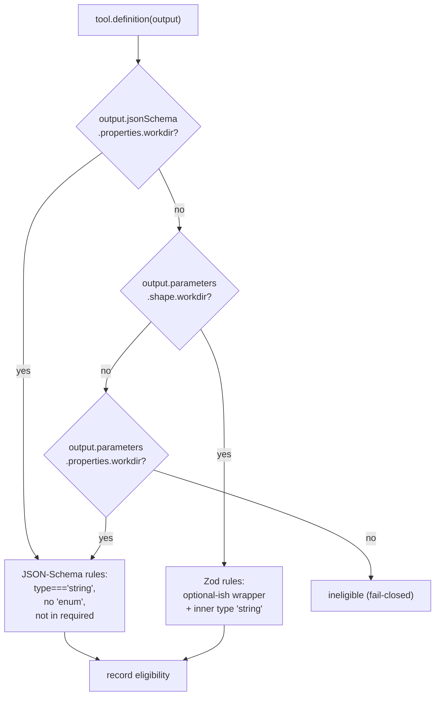

# Design: Correct workdir-eligibility detection

## Context

`isWorkdirEligible` reads `output.parameters?.properties?.workdir` in the
`tool.definition` hook. Production diagnostics showed this yields
`undefined` for every plugin-authored tool
(`workdir-capability: openspec_cli => false (workdir prop: undefined,
required: undefined)`), so `generalize-workdir-injection` has never worked
for any tool except the hardcoded `bash`.

The proposal attributed this to `output.parameters` being a **Zod
`ZodObject`** (which exposes `.shape`, not `.properties`). Reading
opencode's own registry source shows that inference is **incorrect for
current opencode**, and that a third field — already passed to the hook —
carries the data we actually want.

### What the hook actually receives

`packages/opencode/src/tool/registry.ts` builds the hook payload from three
fields, then triggers the plugin:

```ts
const output = { description, parameters: tool.parameters, jsonSchema: tool.jsonSchema }
yield* plugin.trigger("tool.definition", { toolID: tool.id }, output)
```

For plugin-authored tools (`fromPlugin`, same file):

```ts
const zodParams  = allZod ? z.object(args) : undefined          // local only
const jsonSchema = zodParams ? zodJsonSchema(zodParams) : legacyJsonSchema(entries)
const parameters = zodParams
  ? Schema.declare<unknown>((u): u is unknown => zodParams.safeParse(u).success)
  : Schema.Unknown
```

The `ZodObject` is a **local variable that is never exported**.
`Tool.Def.parameters` is typed `Schema.Decoder<unknown>` — an opaque Effect
Schema predicate with no `.shape`, no `.properties`, no `.required`.
`Tool.Def.jsonSchema?: JSONSchema7` is the real, LLM-facing schema.

**Consequence: `parameters?.shape?.workdir` is `undefined` too.** The
proposed fix would not have resolved the incident.

### Empirical findings (zod 4.1.8, verified by execution)

| Claim | Verdict |
|---|---|
| `z.object({...}).properties` is `undefined` | **Confirmed** |
| `z.object({...}).required` is `undefined` | **False** — it is a *method*; `JSON.stringify(fn)` → `undefined`, which is why the diagnostic *looked* like an absent field |
| The diagnostic discriminates ZodObject vs. raw shape vs. Effect Schema | **No** — all three log `workdir prop: undefined, required: undefined` |
| `ZodEnum` is not a `ZodString`, so no separate enum check is needed | **Holds for the Zod path only** (proto chain is `ZodEnum → Object`). On the JSON-Schema path `z.enum()` serialises to `{type:"string", enum:[…]}`, so the existing `'enum' in prop` check is **load-bearing** and must not be removed |
| Zod schemas are immutable; `.describe()` returns a new instance | **Confirmed** |
| In-place `prop.description = …` on a Zod schema silently no-ops | **False** — under ESM (always strict), it **throws** `TypeError: Cannot set property description of #<_> which has only a getter` |
| `instanceof` needs a single shared zod module copy | **False** — zod v4 defines `Symbol.hasInstance` as a structural trait check (`inst?._zod?.traits?.has(name)`), so `instanceof` survives duplicate installs |

Applying the **existing, unmodified** predicate to `output.jsonSchema` for
an `openspec_cli`-shaped tool returns `true`. The predicate logic was never
wrong — **it was reading the wrong field.**

### Version skew

The installed plugin package is `@opencode-ai/plugin@1.15.7`; the registry
source read above is opencode `1.18.26`. A comment in `fromPlugin` records
that *"pre-1.14.49 the code was `z.object(def.args)`"*, i.e. `parameters`
**was** a `ZodObject` in older hosts. `package.json` declares
`peerDependencies: { "@opencode-ai/plugin": ">=1.15.0" }` — an open-ended
range that spans both host generations. The design must therefore work
across the range it already claims to support.

## Decisions

### D1 — Three-path detection, `jsonSchema` first

Try each schema source in order and use the first that yields a `workdir`
property; the per-property rules are unchanged from today.



- **Path 1 — `output.jsonSchema`** (current opencode; also the natural shape
  for MCP-registered tools). Reuse today's predicate body verbatim.
- **Path 2 — `output.parameters.shape`** (hosts ≤ ~1.14.49 where
  `parameters` was a `ZodObject`).
- **Path 3 — `output.parameters`** treated as JSON Schema. Retains existing
  behaviour for any other source; costs one line.

Multi-path is **not** speculative generality — it is exactly the declared
`>=1.15.0` support surface. Every path failing is fail-closed (no
injection), never a malformed argument.

Refactor the per-property rules into one small helper so paths 1 and 3
share it:

```js
// illustrative shape, not the implementation
function eligibleFromJsonSchema(schema) {
  const prop = schema?.properties?.workdir
  if (!prop || prop.type !== 'string' || 'enum' in prop) return false
  const required = schema?.required
  return !(Array.isArray(required) && required.includes('workdir'))
}
```

### D2 — Zod detection by duck-typing, not `instanceof`

On path 2, classify via `schema?._zod?.def?.type` rather than
`instanceof z.ZodOptional` / `z.ZodString`:

```js
// illustrative shape
const t = prop?._zod?.def?.type
const inner = prop?._zod?.def?.innerType?._zod?.def?.type
const eligible = OPTIONAL_WRAPPERS.has(t) && inner === 'string'   // 'optional' | 'default' | 'prefault'
```

Rationale: it needs no `zod` import, is immune to module identity, matches
how opencode itself detects Zod values (`isZodType` = `"_zod" in value`),
and handles `.default()` / `.prefault()` — which `instanceof z.ZodOptional`
misclassifies as ineligible. Verified against 19 wrapper permutations.

### D3 — Do **not** add `zod` as a dependency

Path 1 needs no Zod. Path 2 uses duck-typing. The proposal's stated
rationale (making `instanceof` reliable across module copies) is moot —
zod v4's `instanceof` is already structural. Adding a hard `dependency`
would *introduce* a duplicate-install and version-skew surface that does
not exist today, and would be inconsistent with the existing
peer-dependency-only `package.json`. If `instanceof` is preferred anyway,
`zod` must be a **peer** dependency, never a regular one.

### D4 — Annotation writes to the source that matched

- **Path 1/3 (JSON Schema):** plain object — mutate
  `prop.description` in place. Verified: no getter, no throw, mutation
  sticks.
- **Path 2 (Zod):** schemas are immutable — reassign
  `parameters.shape.workdir = zodProp.describe(next)`. Verified: `.shape`
  is an own accessor with a setter, `shape === _zod.def.shape`, the
  reassignment propagates into `z.toJSONSchema()` output and does not break
  parsing. In-place `.description =` **throws** in ESM and must not be used.

The existing idempotency sentinel becomes load-bearing: `output.jsonSchema`
is the *same object* as `tool.jsonSchema`, so an in-place annotation
persists on the shared `Tool.Def` across turns. The
`description?.includes(WORKDIR_ANNOTATION)` guard already handles this —
keep it.

### D5 — Edge cases need no extra code on path 1

Serialised through `z.toJSONSchema(…, { io: "input" })`:

| Author writes | JSON Schema | Verdict |
|---|---|---|
| `.optional()` | `{type:"string"}`, not in `required` | eligible ✓ |
| `.default("x")` | `{type:"string", default:"x"}`, not in `required` | eligible ✓ |
| `.nullish()` | `{anyOf:[…]}`, no `type` | ineligible (fail-closed) |
| `.nullable()` | `{anyOf:[…]}`, **in** `required` | ineligible ✓ correct |
| `.enum([…]).optional()` | `{type:"string", enum:[…]}` | ineligible ✓ **via the `enum` check** |

`.nullable()` correctly stays ineligible: nullable is not optional — the key
is still required. `.nullish()` is a fail-closed miss; not worth code.

### D6 — Extend the diagnostic to confirm which path fired

Add `jsonSchema` presence and the matched path to the existing
capability log line, e.g.
`workdir-capability: openspec_cli => true (via jsonSchema)`.
This retires the ambiguity that produced the original misdiagnosis and
confirms which host generation is live — without blocking the fix.

## Alternatives Considered

| Alternative | Why not |
|---|---|
| **Zod-only two-path fix (as proposed)** | `output.parameters` is an opaque Effect Schema on current opencode; `.shape` is `undefined`. Would not resolve the incident. |
| **Behavioural predicate** (`safeParse(undefined).success && safeParse("/probe").success`) | Most accurate across wrappers and immune to internals, but only applies to path 2, runs user validators (`.refine()` on a probe path, async schemas throwing), and adds a side-effect surface for no gain once path 1 exists. |
| **Full Zod wrapper-walk** (recursive `innerType` traversal) | Correctly resolves all 19 permutations, but the permutations only matter on the legacy path; ~12 lines for cases no known tool declares. YAGNI. |
| **Read `output.jsonSchema` only** | Simplest, but silently drops support for hosts below the declared `>=1.15.0` floor. One extra path is cheaper than a support-range change. |
| **Replace `output.parameters` with a fresh `z.object()`** to force schema regeneration | Unnecessary: in-place `jsonSchema` mutation is preserved by the registry's pass-through, and replacing `parameters` would discard the host's Effect Schema validator. |

## Non-Goals

- **Fully verifying that the annotation reaches the live LLM-facing schema.**
  Source reading indicates in-place `jsonSchema` mutation is preserved by
  the registry (`output.parameters === tool.parameters` keeps
  `output.jsonSchema` in the returned definition), but this is not
  end-to-end confirmed against the running host. Best-effort; the
  functional injection fix does not depend on it.
- Explaining why no `workdir-capability: bash => …` line appears in the log.
  `registry.ts` iterates all visible tools, so the hook should fire for
  `bash`. Unresolved and **out of scope** — `bash` is hardcoded eligible and
  works regardless.
- Changing the `bash` hardcode, the injection mechanism, or the
  system-prompt hook.
- Renaming the change. `fix-zod-schema-eligibility-detection` is now a
  slight misnomer (the fix is primarily JSON-Schema-based), but renaming
  mid-incident is churn.

## Risks / Trade-offs

| Risk | Severity | Mitigation |
|---|---|---|
| **Host-version assumption.** `fromPlugin` was read at 1.18.26; the live host may predate the Effect-Schema boxing. | Medium | Three-path detection covers both generations. D6 confirms which fired. |
| `_zod.def.type` is a private field and may change across zod minors. | Low | Only path 2 (legacy hosts) depends on it; failure is fail-closed. opencode itself relies on `_zod`. |
| In-place `jsonSchema` mutation persists on the shared `Tool.Def` across turns. | Low | Existing idempotency sentinel prevents duplicate appends. Verify a test covers repeated `tool.definition` firings on the same object. |
| Annotation silently fails to reach the model. | Low | Explicit non-goal; injection is independent of annotation. |
| Tests continue to assert a shape that never occurs. | **High** | The current JSON-literal mocks are exactly how this bug survived. Fixtures must mirror real payloads: a `jsonSchema` object produced by `z.toJSONSchema(z.object(args), { io: "input" })` for path 1, and a real `z.object()` for path 2. |
| `.nullish()`-declared `workdir` is missed. | Very low | Fail-closed; no known tool uses it. |

### Verify with real zod before implementing

1. Confirm the live host's payload shape by logging, once, whether
   `output.jsonSchema?.properties?.workdir` and
   `output.parameters?.shape?.workdir` are populated (D6). This is the
   single fact the whole fix turns on.
2. Confirm the enum case end-to-end — that a `z.enum()`-typed `workdir`
   still serialises with `enum` present and is rejected.

## Component Breakdown

| Component | Work kind | Done criterion |
|---|---|---|
| `isWorkdirEligible` → three-path detection + shared JSON-Schema helper | Application code (JS) | Returns `true` for an `openspec_cli`-shaped `jsonSchema`; `false` for enum-constrained, non-string, required, or absent `workdir`; `false` when all sources are absent |
| Zod duck-type branch | Application code (JS) | Correctly classifies `optional` / `default` / `prefault` over an inner `string`; rejects enum, literal, number; no `zod` import |
| `tool.definition` annotation | Application code (JS) | Mutates JSON-Schema descriptions in place; reassigns Zod shape entries; never assigns `.description` on a Zod schema; appends at most once |
| Capability diagnostic (D6) | Application code (JS) | Log line names the matched path |
| `package.json` | Dependency manifest | **Amended during implementation**: `zod` added as a **devDependency** (test fixtures use real `z.object()`/`z.toJSONSchema()` output — required to exercise real schema shapes per the Test fixtures row below). `src/index.js` still has zero `zod` import; D3's concern (a runtime dependency reintroducing duplicate-install/version-skew risk) does not apply to a devDependency. |
| Test fixtures | Test code | Non-bash fixtures built from real `z.toJSONSchema(z.object(args), { io:"input" })` output and real `z.object()`; a repeat-firing idempotency case |
| `openspec/specs/workdir-injection/spec.md` delta | Spec authoring (engineer-owned) | Capability predicate reworded to be schema-source-agnostic — see below |

### Requirement implied by this design

The spec currently pins the predicate to one shape: *"its schema (as
reported to the `tool.definition` hook) declares a `workdir` parameter of
type `string`, with no `enum` constraint, that is not listed as
`required`."* This should become source-agnostic — the tool is
workdir-capable when **any** schema representation offered to the hook
(JSON Schema via `jsonSchema`, a Zod object via `parameters.shape`, or a
JSON-Schema-shaped `parameters`) declares an optional, unconstrained
`workdir` string; sources are consulted in that order and the first
carrying a `workdir` property decides. The `enum` exclusion remains
required for JSON-Schema sources. The annotation requirement gains: the
annotation is written back to whichever source matched.

Diagnostics gain: the capability log line records which schema source
matched.
