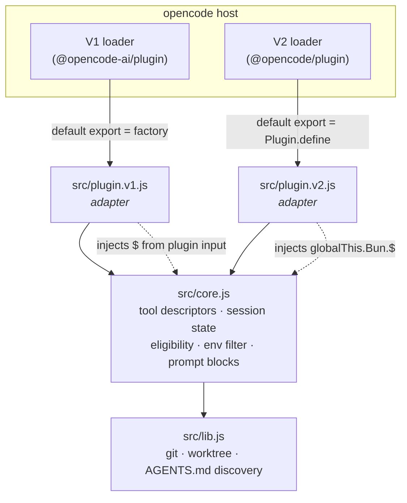

# Design — v2-plugin-migration

Re-platforming `opencode-use` onto opencode's V2 plugin SDK (`@opencode/plugin`
2.0.x, `Plugin.define({ id, setup(ctx) })`) while keeping the V1
(`@opencode-ai/plugin`) entrypoint alive for the duration of the compatibility
window.

**This is not a behaviour change.** The five specs under `openspec/specs/`
define what the plugin does; this change moves *how* it does it onto a second
runtime. Every requirement must hold on both, verified by one spec suite — with
exactly one confirmed exception (D6), which needs a spec delta.

## Scope (confirmed)

| | |
|---|---|
| **Problem** | V1 plugin implementations do not run under V2 at all. The V1 bridge is time-boxed. |
| **Must hold** | All requirements in `openspec/specs/{context-autoload,path-resolution,workdir-injection,worktree-branch-reuse,worktree-git-root}/spec.md`, on both runtimes. |
| **Runtime** | opencode V2 CLI is Bun-hosted. Node ≥22.5 for the test suite (`node --test`). |
| **Constraint (given)** | A single hybrid-shape entrypoint does not work on real V1 builds — two entrypoint files are required. |
| **Constraint (given)** | V2 tool schemas are always JSON Schema. V2 renamed the built-in `bash` tool to `shell`. |
| **Failure tolerance** | A plugin fault must never fail a host tool call. Every hook body is already `try`/`catch`-and-log; that invariant carries over verbatim. |
| **Out of scope** | New user-facing capability; changes to `lib.js` git/worktree behaviour; dropping V1. |

## D1 — Code sharing: extract a runtime-agnostic core

### Options

**A — Two full entrypoints, shared `lib.js` only** (the current WIP shape).
`plugin.v1.js` (~997 lines) and `plugin.v2.js` (~631 lines) each carry their own
copy of session state, path resolution, env-key filtering, workdir-eligibility,
the system-prompt block text, and all four tool `execute` bodies.
*Trade-off:* zero refactor cost today; every behaviour fix and every spec must
be implemented and tested twice, indefinitely, with no mechanism forcing the two
copies to agree.

**B — Extract `src/core.js`; entrypoints become adapters.**
`core.js` holds everything runtime-agnostic: the session-state map, the four
tool *descriptors* (`{ name, description, schema, execute(input, deps) }`), the
workdir-eligibility predicate, the annotation text, the env-key filter, and the
system-prompt block builders. `plugin.v1.js` and `plugin.v2.js` translate each
host's hook surface onto it and inject host-specific dependencies (`$`, the log
sink, the base directory).
*Trade-off:* one refactor pass over spec-covered V1 code; both entrypoints drop
to roughly adapter size; the V1↔V2 difference becomes literally the adapter.

### Decision — B

Option A's drift risk is not hypothetical: the WIP V2 entrypoint has **already**
diverged from V1 on three spec'd behaviours (D10) after a single commit. A
re-platforming whose entire success criterion is "the same specs hold on both
runtimes" cannot be built on a structure that permits the two runtimes to
disagree silently.

- **Resilience** — one behaviour, one place; the spec suite exercises it once.
- **Maintainability** — retiring V1 becomes deleting one adapter and one export.
- **Clarity/simplicity** — the diff a reader must understand shrinks to the wiring.
- **YAGNI** — this is not speculative generality: the second consumer exists
  today. Correspondingly, `core.js` gets **no** runtime-capability registry, no
  plugin framework, no abstraction over hooks. It exports plain descriptors and
  pure functions; the adapters do the wiring by hand.

`lib.js` is unchanged and keeps its existing constraint (imported, never
scanned). `core.js` inherits the same constraint — see D8.



## D2 — Shell dependency (`$`) injection

V1 receives `$` in its plugin input. **V2's `Context` has no `$`** (confirmed:
`dist/promise/plugin.d.ts` lists no shell-exec member). The WIP resolves this by
reaching for the global `Bun.$` inside each tool body.

That choice has two costs: it hard-binds the tool bodies to a Bun global, and it
makes the bodies unrunnable under `node --test` (`Bun` is undefined → the entire
spec suite is unavailable to V2). The existing V1 tests depend on passing a
**fake `$`** to avoid spawning `direnv` and `git`.

**Decision:** `core.js` takes `$` as an injected dependency, exactly as the V1
tests already supply it. The V2 adapter resolves it once at `setup()` from
`globalThis.Bun?.$` and, if absent, fails loudly at load time with an actionable
message rather than at first tool call. No Node shell fallback is written — V2
is Bun-hosted; writing one now is speculative (YAGNI). If a non-Bun V2 host ever
appears, the seam for adding one already exists.

## D3 — Hook mapping (ground truth — do not re-derive)

| V1 hook | V2 destination | Payload contract |
|---|---|---|
| tool map (`use_cwd`, `use_direnv`, `use_worktree`, `use_clear`) | `ctx.tool.transform((editor) => editor.add(...))` | `Tool.Info`: `{ name, input: JsonSchema, description, execute(input, ToolContext), output?, options? }`. Schemas are **always** JSON Schema in V2. |
| `tool.definition` (workdir annotation) | same `transform`, via `editor.update(id, (tool) => …)`; re-run on `mcp.tools.changed` | `ToolEditor`: `list()`, `get(id)`, `namespace(…)`, `add(tool)`, `update(id, fn)`, `remove(id)` |
| `tool.execute.before` | `ctx.tool.hook("execute.before", …)` | `{ tool, sessionID, agent, messageID, id, input }` — `input` is mutable; **mutate in place** |
| `shell.env` | `ctx.shell.hook("create.before", …)` | `{ command, cwd, timeout, shell, env }` — mutate `event.env` in place. **No `sessionID`** → see D6 |
| `experimental.chat.system.transform` | `ctx.session.hook("context", …)` | `SessionContext`: `{ sessionID, agent, system, messages, tools, options }` — push `{ type: 'text', text }` onto `event.system` |

Two mechanical consequences, both already identified:

- **`bash` → `shell`.** The always-eligible built-in name in the injection
  predicate becomes `shell` on V2. Keep it a per-adapter constant, not a
  hard-coded literal inside `core.js`.
- **Schema sources collapse from three to one.** V1's spec mandates a three-source
  ladder (`jsonSchema` → raw Zod `parameters.shape` → `parameters`-as-JSON-Schema).
  V2 offers one. The predicate in `core.js` takes the *already-extracted*
  JSON-Schema object; each adapter is responsible for finding it. This keeps
  V1's Zod branches out of the V2 path without duplicating the predicate. See
  D10 — the spec text needs a delta to stop naming V1-only sources as normative.

## D4 — `options: { codemode: false }` is mandatory

Confirmed empirically: a V2 tool registered with no `options`, or with
`codemode: true`, is **Code-Mode-only** — the model can reach it only indirectly
through a separate `execute` JS-execution tool, never as a direct native tool
call. `pinned: true` does not fix this (tested, no effect). Setting
`options: { codemode: false }` is the only confirmed fix.

This is not a detail: direct, natively-callable tools *are* the product.
Omitting the option does not error, does not warn, and does not change any
unit-testable value — it silently removes the plugin's reason to exist.

**Decision:** `codemode: false` is carried in the tool **descriptor in
`core.js`**, not written by hand at each `editor.add()` call site — a per-call
literal is precisely the kind of thing that gets dropped when a fifth tool is
added. It is additionally guarded twice: an adapter-level assertion that every
registered tool carries `options.codemode === false` (D9 layer 2), and the
end-to-end direct-callability check (D9 layer 3), which is the only check that
can actually observe the failure mode.

## D5 — Packaging

```
main     → src/plugin.v1.js          (unchanged default: existing V1 installs keep working)
exports  → "."    → src/plugin.v1.js
           "./v1" → src/plugin.v1.js  (explicit pin)
           "./v2" → src/plugin.v2.js
```

- `"."` stays V1 for the whole bridge window. Flipping it is the *retirement*
  step, not part of this change: it would break every existing consumer's
  config/symlink with no opt-out.
- `"./v1"` is added alongside so a consumer can pin explicitly **now** and be
  unaffected by the eventual flip. Justified by a decision already taken (V1 will
  be retired), not by speculation.
- **Both** peer dependencies must be optional. The current manifest marks only
  `@opencode/plugin` optional, which forces a V2-only consumer to install the V1
  SDK. Each entrypoint imports exactly one SDK at module scope; neither is
  required by the other.
- `@opencode/cli` is added as a **devDependency** — the end-to-end gate in D9
  cannot run without it, and the proposal's package.json change list omits it.

## D6 — The confirmed behavioural gap: env injection without a `sessionID`

`ShellCreateBefore` carries `{ command, cwd, timeout, shell, env }` and **no
`sessionID`**. V1's `shell.env` had one, and the spec is written in terms of it:
it requires injection "for every shell invocation opencode triggers with a known
`sessionID`", and mandates *no* injection when the session ID is absent or
unknown. On V2 that predicate is not computable.

### Options

**A — Inject only when exactly one session exists** (the WIP: `sessions.size !== 1 → return`).
Fails the moment any second session is tracked — including an env-less one, and
including a subagent's. Worse, the session map only grows, so in a long-lived
opencode process the feature degrades to *permanently off* with no signal.
Silent, unrecoverable loss of the feature.

**B — Most-recently-set env, applied globally.**
Deterministic and simple. But when two sessions are live it injects session A's
environment into session B's shell — the failure is *wrong values*, not missing
ones: the wrong `AWS_PROFILE`, `KUBECONFIG`, or `DATABASE_URL` executing against
a real system, with no error raised.

**C — Correlate on `event.cwd`.**
The payload's `cwd` is a genuine correlator: this plugin's entire purpose is to
put different sessions in different directories, and the `execute.before` hook
already drives the shell's `cwd` from the same session state. Costs a few lines.
Does not cover the spec'd case where `use_direnv` loads env **without** moving
the directory.

**D — Do not inject on V2 at all.** Correct; discards the feature.

### Decision — a fail-closed resolution ladder (C over B, never A)

The adapter resolves *which* session's env to apply, in this order:

1. **Exactly one session has a non-empty env** → use it.
2. **Otherwise**, if exactly one env-bearing session's `state.cwd` equals
   `event.cwd`, or is an ancestor of it → use that session's env.
3. **Otherwise** → inject nothing, and log once naming the candidate sessions.

**Governing principle: for environment injection, prefer failing *closed* over
failing *wrong*.** A missing variable produces a loud, immediately diagnosable
error at the point of use. A wrong variable silently executes against the wrong
system. That asymmetry is what rules out Option B as the primary strategy.

Rule 1 is deliberately keyed on *env-bearing* sessions rather than session count —
that is the specific defect in Option A, where an unrelated, env-less session
switches the feature off forever. Rule 2 adds the only disambiguator the payload
actually offers, at the cost of a containment check. Rule 3 is the honest answer
when the host has genuinely destroyed the information.

**Visibility.** The caveat must be in-band, not just in a comment: on V2, the
`Active Session Context` block's environment line states that env injection is
best-effort and may be suppressed while multiple sessions hold environments. The
V1 line is unchanged. This is the one place the two adapters' prompt text
legitimately differs, and `core.js` builds both variants from one template.

**Follow-up (record, do not build):** if V2 later exposes a session-end or
session-idle event, pruning ended sessions' env makes rule 1 hit far more often.
Do not invent an event name — verify one exists first.

## D7 — Catalog re-scan on `mcp.tools.changed`

`ctx.tool.transform(...)` returns a Registration (`.dispose()`); re-running it —
or `ctx.tool.reload()` — picks up tools that appear after setup. **Correction:**
an earlier draft of this design named this event `catalog.updated`, which
does not exist anywhere in `@opencode/schema`'s event manifest (verified by
enumerating every event `type` literal in the installed package's own
`event-manifest.d.ts` — a `code-reviewer` finding). The real, verified-to-
exist event is `mcp.tools.changed`; whether it actually fires on every MCP
server connect (as its name strongly implies) has not been confirmed via a
live run with an MCP server connecting mid-session — only that it is a real
member of the event type union, unlike the fabricated name it replaces.
`ctx.event.subscribe` exists on `EventDomain`.

Three requirements on the implementation:

- **Idempotence.** The annotation pass must remain safe to run repeatedly — the
  "already contains the annotation" guard is what makes reload non-destructive,
  and it is load-bearing, not an optimisation.
- **Recursion guard.** Calling `ctx.tool.reload()` from inside a
  `mcp.tools.changed` handler can plausibly re-emit `mcp.tools.changed`. The handler
  must not re-enter while a reload is in flight. The WIP has no such guard.
- **Cleanup.** The subscription is aborted from the `setup()` return value; the
  transform Registration is disposed alongside it.

## D8 — Export surface

V1's legacy loader invokes *every* function-typed top-level export as a plugin
factory — the reason `lib.js` is imported rather than scanned, and why
`plugin.v1.js` exports nothing but `default`. `core.js` is subject to the same
rule and the same placement constraint.

`plugin.v2.js`'s default export is a `Plugin` object rather than a function, so
the V1 hazard does not apply to it on V2 — but it exports `default` only, for the
same reason, since nothing prevents a user pointing a V1 host at the file.

**Verification item (must be checked, not assumed):** `editor.add()` takes a
`name`, while `editor.list()` yields entries keyed by `id`, and `Tool.Options`
has a `namespace` field. If V2 derives a namespaced `id` from `name`, the
self-tool exclusion set (`use_cwd`/`use_direnv`/`use_worktree`/`use_clear`) must
be keyed on whatever `list()` reports, or the plugin will annotate and inject
into its own tools. Confirm against the live catalog before wiring.

## D9 — Test strategy

Three layers. Layers 1–2 are hermetic and run under `node --test` in the default
`npm test`, matching the existing suite's style (fake `$`, real temp dirs, one
`// spec:` header per file). Layer 3 is a separate script and CI job.

**Layer 1 — Spec suite against `core.js`** (as designed; **not fully carried
out** — see the implementation-status note at the end of this section). The
five spec files should be exercised once, against injected fakes, not twice
against two entrypoints. This is the intended payoff of D1: "the same specs
hold on both runtimes" becomes structurally true rather than a thing two
test files separately assert. Existing tests are re-pointed from
`plugin.v1.js` to the core seam; their assertions do not change.

> **Implementation status:** the five existing spec test files were left
> importing `plugin.v1.js` unchanged (zero diff), not re-pointed at
> `core.js` directly. Because `plugin.v1.js` is a thin pass-through, this
> still transitively exercises `core.js`'s logic — but it does not
> structurally guarantee the V2 adapter's own wiring is correct the way
> this section originally intended; that is instead covered separately by
> Layer 2's `plugin-v2-conformance.test.js`. Re-pointing these five files
> remains a legitimate follow-up.

**Layer 2 — Adapter conformance, one file per entrypoint.** Mocks the host
surface (`ctx` for V2, the plugin input for V1) and asserts the *wiring only*:

- all four tools registered, each with `options.codemode === false` (D4 guard);
- `execute.before` mutates `event.input` in place and leaves an explicit
  `workdir` untouched;
- `shell` (not `bash`) is the always-eligible built-in on V2;
- `create.before` mutates `event.env`, and the D6 ladder picks the expected
  session across the single-env, cwd-match, and ambiguous cases;
- the session-context hook pushes `{ type: 'text', … }` onto `event.system`,
  including the AGENTS.md advisory block when present (D10);
- `setup()`'s cleanup disposes the subscription and the transform registration;
- export-surface guard extended to `plugin.v2.js` and `core.js`.

**Layer 3 — One real end-to-end run against `@opencode/cli` v2.** Non-negotiable,
because the highest-consequence failure in this change (D4's silent Code-Mode
demotion) is invisible to every mock: a tool registered without
`options.codemode: false` looks identical in unit tests and is simply
unreachable in production. The run must assert, against the real runtime:

1. `use_cwd` is invoked as a **direct native tool call** (not via Code Mode);
2. a subsequent eligible tool call receives the injected `workdir`;
3. the `Active Session Context` block appears in the assembled system prompt.

Kept out of `npm test` so the default suite stays hermetic and fast; wired into
CI as its own job so it cannot be quietly skipped.

## D10 — Behavioural requirements this change implies

Recorded here for the implementing engineer to transcribe into spec deltas. **The
proposal's `skip_specs: true` and its "no spec-level behaviour changes" claim do
not survive contact with the spec text**, on two counts.

**R1 — Hook names in specs must become mechanism-neutral.**
`workdir-injection` and `context-autoload` name V1 mechanisms as normative
(`experimental.chat.system.transform`, `tool.definition`, `tool.execute.before`,
`shell.env`), and `workdir-injection` mandates the three-source schema ladder
including raw-Zod detection. On V2 these are unsatisfiable as written. Each
should state the behaviour and name the per-runtime mechanism as a note.
(`path-resolution`, `worktree-git-root`, `worktree-branch-reuse` are already
runtime-neutral and need no delta.)

**R2 — The `shell.env` session-scoping requirement is a real behavioural delta.**
Its scenarios "invocation carries no session ID → `env` not modified" and
"unknown session ID → not modified" are defined in terms of a field V2 does not
provide. The spec needs a V2 clause describing the D6 ladder and its fail-closed
guarantee: *no* invocation ever receives an environment belonging to a session
other than the one resolved by the ladder.

**R3 — Three V1 behaviours are missing from the WIP V2 entrypoint** and must be
restored (they are spec'd, so D1's shared core removes the possibility of the
omission recurring):

- The **AGENTS.md advisory block** — `context-autoload`'s "Advisory
  System-Prompt Injection" requirement, including the computed backtick-fence
  length, repository/file path, and untrusted-input framing. The V2 session hook
  currently emits only the Active Session Context block.
- **`use_clear` clearing `state.agentsMd`** whenever `state.cwd` becomes falsy,
  and reporting the cleared repository — `context-autoload`'s last requirement.
- **Diagnostics detail** — `workdir-injection` requires an ineligible-capability
  log line to include the raw `workdir` property and the schema's `required`
  array.

## Resilience & operations

| Failure mode | Blast radius | Behaviour |
|---|---|---|
| A hook body throws | Host tool call | Contained: every hook body catches and logs; the host call proceeds unmodified. Carried over verbatim. |
| `globalThis.Bun.$` absent (non-Bun V2 host) | Plugin load | Fails loudly at `setup()` with an actionable message — not at first tool use (D2). |
| `options.codemode` dropped on a new tool | That tool becomes unreachable | Caught by the layer-2 assertion and the layer-3 E2E (D4). Invisible to any other check. |
| Concurrent sessions with distinct envs | One shell invocation | Fails closed: no env injected, one diagnostic logged (D6). Never injects another session's env. |
| `mcp.tools.changed` storm / reload recursion | Plugin CPU | Guarded by the re-entrancy check and idempotent annotation (D7). |
| V2 namespaces tool ids | Self-annotation / self-injection | Prevented by keying the exclusion set on `list()` ids — pending the D8 verification. |
| V1 SDK absent for a V2-only consumer | Install | Prevented by marking both peer deps optional (D5). |

**Migration delta.** `src/index.js` → `src/plugin.v1.js` via `git mv` (history
preserved); behaviour-carrying code moves out of it into `src/core.js`;
`src/plugin.v2.js` is rewritten as an adapter over that core; `lib.js` untouched.
V1 consumers see no change through `"."`. V2 consumers opt in via `"./v2"`.
Retirement, later and out of scope here, is: delete `plugin.v1.js`, drop the V1
peer dep, repoint `"."` at V2.

**Scaling.** Per-session state is a `Map` that only grows within a host process.
That is pre-existing, and bounded in practice — but it is now *load-bearing* for
D6 rule 1, which is why that rule keys on env-bearing sessions rather than on
map size.

## Component breakdown

Each part with its work-kind and done-criterion. No agent assignment; no task
sequencing — both belong to the implementing agent.

| # | Component | Work kind | Done when |
|---|---|---|---|
| 1 | `src/core.js` — session state, four tool descriptors (with `codemode: false`), eligibility predicate, annotation text, env-key filter, prompt-block builders; `$`/log/base-dir injected | Application code (JS) | Exports `default`-free named surface consumed only by adapters; the full spec suite passes against it with a fake `$` |
| 2 | `src/plugin.v1.js` — reduced to a V1 adapter over `core.js` | Application code (JS) | Existing V1 tests pass unchanged in assertion content; file exports `default` only |
| 3 | `src/plugin.v2.js` — V2 adapter: `Plugin.define`, the five-hook mapping (D3), `shell` built-in name, `Bun.$` resolution with a loud failure, cleanup | Application code (JS) | Layer-2 conformance suite passes; file exports `default` only |
| 4 | D6 env-resolution ladder + the V2-variant context-block caveat line | Application code (JS) | Single-env, cwd-match, and ambiguous cases each assert the specified outcome, including the no-injection + log case |
| 5 | `mcp.tools.changed` re-scan with re-entrancy guard and disposal | Application code (JS) | Repeated reloads annotate exactly once; cleanup disposes subscription and registration |
| 6 | D8 tool-id/namespace verification against the live catalog | Investigation | The exclusion set is keyed on the value `list()` actually reports, evidenced from a real run |
| 7 | `package.json` — exports map, both peer deps optional, `@opencode/cli` devDependency, `test` / `test:e2e` scripts | Packaging | A V2-only and a V1-only install each resolve without pulling the other SDK |
| 8 | Spec deltas R1–R3 | Spec authoring | `openspec/specs/{workdir-injection,context-autoload}` carry no unsatisfiable V1-mechanism requirement, and the V2 env-scoping clause exists |
| 9 | Layer 1–2 test suites | Test code | `npm test` green under `node --test`, hermetic (no `git`/`direnv`/network) |
| 10 | Layer 3 end-to-end gate + CI job | Test code / CI | The real-runtime run asserts direct callability, workdir injection, and prompt injection, and fails the build on regression |
| 11 | `docs/v2-compat-audit.md` correction; README note on `./v2` and the D6 caveat | Documentation | The audit names its real target and states the port's status; the D6 limitation is documented user-facing, not only in code comments |

## Research needs

All V2 API shapes used above were supplied as confirmed ground truth in the
task brief and independently corroborated against the installed
`@opencode/plugin@2.0.4` type definitions (`ShellCreateBefore` has no
`sessionID`; `ToolDomain` exposes `transform`/`reload`/`hook`; `EventDomain`
exposes `subscribe`; `Tool.Options.codemode`; `Context` has no `$`). One item
remains open and is carried as component 6 rather than assumed: whether V2
derives a namespaced tool `id` from the registered `name` (D8).
