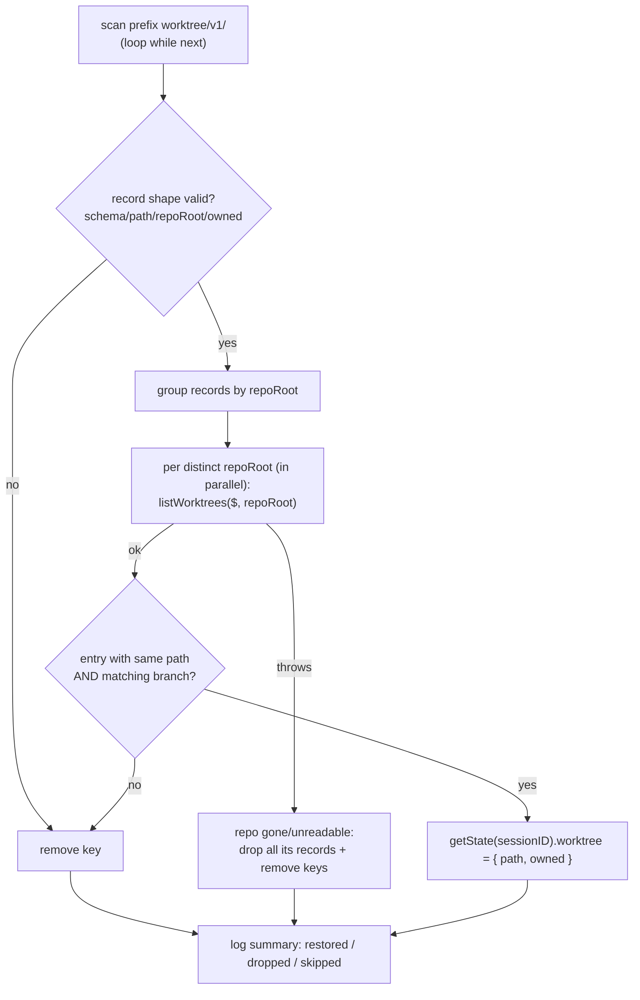

# Design

## Context

See `proposal.md` — *Why* for motivation. This section records only the
constraints of the existing code that shape the approach.

- **`src/core.js` is host-agnostic (D1 of the prior change's design).** It
  imports nothing from either plugin host. Any persistence must arrive as an
  injected dependency, never as a direct `ctx.storage` reference.
- **The four tool bodies receive `(input, state, deps)`** where
  `deps = { $, log, directory }`. They never see a `sessionID`: `getState()`
  is called by the adapter, and only the resulting `SessionState` object is
  passed down. Any per-session persistence therefore has to be bound to the
  session *before* it enters a tool body, or `sessionID` has to be threaded in.
- **Three of the four V2 hook consumers read `sessions` directly and
  synchronously** (`execute.before`, `create.before` via
  `resolveEnvSessionForShell`, `session.hook('context')`). Nothing may make
  `getState()` async, and nothing may rely on a tool call happening first to
  trigger rehydration.
- **`state.worktree` is written at exactly four sites** in
  `executeUseWorktree` (normal creation, existing-branch recovery, and two
  `already exists` reuse returns) and cleared at exactly one site in
  `executeUseClear`. `executeUseWorkdir` and `executeUseDirenv` never touch it.
- **`executeUseClear` needs a git root to run `git worktree remove`**, obtained
  via `resolveGitRoot($, gitRootFor(state, directory), worktreePath)`, and
  `gitRootFor` prefers `state.cwd`. After a restart `state.cwd` is `null` (not
  persisted), so the persisted record must itself carry enough information for
  the repository to be found again.
- **`listWorktrees($, root)` requires a repo root** and returns git's own
  (symlink-resolved) absolute paths. Persisted records may span multiple
  repositories, so validation cannot be a single `git worktree list` call.
- **`ctx.storage`** (V2, inside `setup(ctx)`) is
  `{ get(key), set(key, value), remove(key), scan({prefix, after?, limit?}) }`,
  all async, JSON-typed, durable, and already scoped per plugin by the
  plugin's `id` (`opencode-use`). Its on-disk location and file permissions
  are not documented.
- **`ctx.event.subscribe()`** (V2, inside `setup(ctx)`) returns an
  `AsyncIterable` of the same server event stream the TUI and other plugins
  consume, confirmed against the opencode V2 source
  (`packages/plugin/src/promise/event.ts`, `packages/plugin/src/promise/plugin.ts`
  — `EventDomain` exposes `subscribe()`; precedent for filtering it inside a
  plugin's `setup()` at `packages/core/src/plugin/plan.ts`). A `session.deleted`
  event (`packages/schema/src/session-event.ts`) is a *durable* event carrying
  `sessionID` directly on the event object (its schema is `Base = { sessionID,
  ... }`, not nested under a `properties` key) — confirmed by reading the
  schema, not assumed.
- **Existing capability-check precedent:** `globalThis.Bun.$` absence throws at
  `setup()`. `ctx.storage` absence must *not* — persistence is an enhancement,
  not a requirement.

## Goals / Non-Goals

**Goals:**

- A worktree created by a session survives a plugin/process restart as an
  *owned* record, so a later `use_clear` in that same session still removes it
  from disk instead of reporting "Nothing to clear".
- `src/core.js` remains host-agnostic and `getState()` remains synchronous.
- A rehydrated record is never trusted without ground-truth confirmation from
  git; an unconfirmable record is destroyed, not surfaced.
- Absence, failure, or slowness of `ctx.storage` degrades to exactly today's
  behaviour, never to an error or a hung `setup()`.
- The persistence seam is unit-testable without a real `ctx.storage`, a real
  opencode host, or a second OS process.
- A session's persisted ownership record is removed promptly when the
  *session itself* (not just its worktree) is deleted, so storage keys do not
  accumulate for sessions that no longer exist and can never call `use_clear`
  again.

**Non-Goals (design-level, beyond the proposal's scope statement):**

- No change to `getState()`'s signature, to `SessionState`'s shape, or to any
  tool's input schema or public behaviour on the success path.
- No cross-session ownership transfer, and no attempt to make ownership
  git-native — the `already exists → owned: false` heuristic stands as a named
  limitation.
- No time-based sweep for a session that goes idle without being deleted or
  cleared — only explicit deletion (D9) and explicit `use_clear` reclaim a key;
  no compaction, no storage-size budget.
- No encryption, redaction, or permission hardening of the backing store —
  justified below by excluding everything sensitive from the record.
- No persistence on V1.

## Decisions

### D1 — The injected seam is a *raw JSON key/value adapter*, and `core.js` owns the key scheme, record shape, hydration, and validation

```js
// The injected adapter: structurally identical to V2's ctx.storage.
// core.js never imports it — plugin.v2.js passes it in.
/** @typedef {{
 *   get(key: string): Promise<any|undefined>,
 *   set(key: string, value: any): Promise<void>,
 *   remove(key: string): Promise<void>,
 *   scan(opts: { prefix: string, after?: string, limit?: number }):
 *     Promise<{ entries: { key: string, value: any }[], next?: string }>,
 * }} StorageAdapter */
```

`core.js` gains one factory over it:

```js
createWorktreePersistence(storage)  // → null when storage is absent/incomplete
  .hydrate({ sessions, $, log })    // → Promise<{ restored, dropped, skipped }>
  .forSession(sessionID)            // → { save(record), remove() }  (sessionID-bound)
```

`forSession(sessionID)` returns the *only* shape a tool body ever sees:

```js
/** @typedef {{ save(record: WorktreeRecord): Promise<void>,
 *              remove(): Promise<void> }} SessionWorktreePersist */
```

and is threaded in per call as `deps.persistWorktree`, i.e. the V2 adapter
builds `{ ...baseDeps, persistWorktree: persistence?.forSession(toolCtx.sessionID) }`.
Tool bodies call `await deps.persistWorktree?.save(...)` / `?.remove()` and
stay `sessionID`-free and storage-shape-free.

*Rationale.* Two placements were considered for the key scheme, record shape,
and hydration/validation logic:

| | **Semantic adapter** (`{ load(), save(sessionID, wt), remove(sessionID) }`, logic in `plugin.v2.js`) | **Raw KV adapter** (chosen — logic in `core.js`) |
|---|---|---|
| Host-agnosticism of core | Total (core sees only three verbs) | Preserved — core formats key *strings* and validates via the `$` it already has; it imports no host API |
| Testability | Key scheme + validation live in the file that `import`s `@opencode/plugin`; the test double must re-implement them, so tests verify the double, not the code | Hydration/validation are plain exported functions, exercisable with the existing `nodeShellShim` + real temp git repos |
| Duplication | Two implementations (real + fake) of the same semantics | One implementation; the fake supplies only storage bytes |
| V1/future hosts | Each host reimplements the scheme | Any host that can offer four JSON KV methods gets it free |

The raw-KV placement wins decisively on testability, which is the whole point
of the proposal's fake-adapter requirement. Host-agnosticism is not weakened:
a key prefix is a string constant, not a host coupling.

> **Deviation note.** `proposal.md` — *Impact* sketches the adapter as
> `{ load(), save(sessionID, worktree), remove(sessionID) }`. That is the
> semantic-adapter variant. The scope (what is persisted, when, and by whom)
> is unchanged; only the seam's shape differs. Flagged in *Open Questions*.

### D2 — Key scheme: `worktree/v1/<sessionID>`; version in the key path, not only in the body

Storage is already namespaced per plugin by `id: 'opencode-use'`, so no
plugin-level prefix is added. The key is `worktree/v1/<sessionID>`; hydration
scans `prefix: 'worktree/v1/'`.

The schema version lives **in the key path** so a future `worktree/v2/` can be
introduced without the v2 scan ever reading a v1 record, and so a v1 sweep is
a single prefix scan. A redundant `schema` field in the body guards against a
key/body mismatch after a hand-edit or partial migration.

```json
{
  "schema": 1,
  "sessionID": "ses_...",
  "path": "/abs/path/to/.worktrees/my-branch",
  "branch": "my-branch",
  "repoRoot": "/abs/path/to/repo",
  "owned": true,
  "createdAt": "2026-09-23T17:00:00.000Z"
}
```

- `path` — the plugin's own `resolve`d worktree path (what `state.worktree.path`
  holds), so the restored field is byte-identical to what the in-process flow
  would have produced.
- `branch` — strengthens validation: a path can be re-registered later for a
  *different* branch, which must not be mistaken for our worktree.
- `repoRoot` — the `root` that `executeUseWorktree` already resolved. Without
  it, post-restart validation and `use_clear` would have to rediscover the repo
  from a `state.cwd` that no longer exists.
- `owned` — mirrors `state.worktree.owned`.
- `createdAt` — written, not read by this change. Kept deliberately: record
  *format* is the one thing that is expensive to add retroactively, and the
  named follow-up (sweeping abandoned sessions) cannot act on records that
  lack an age. Everything else speculative was dropped (see YAGNI note below).

*Rejected fields (YAGNI):* `cwd`, `env`, `envSource`, `agentsMd` (out of scope
and, for `env`, a plaintext-secret hazard); `pid`/`hostname` (no consumer);
`lastSeenAt` (would require a write on every read path).

### D3 — Eager hydration at `setup()`, fully awaited before any hook or tool is registered

Ordering inside `setup(ctx)`:

1. Resolve `$` and `log` (unchanged; `$` still throws if absent).
2. `createSessionStore()`.
3. Capability-detect `ctx.storage` → `persistence` or `null` (D4).
4. **`await persistence?.hydrate({ sessions, $, log })`** — bounded by a
   timeout, never throwing (D4).
5. `ctx.tool.transform(...)` — register the four tools.
6. Start the existing `ctx.event.subscribe(...)` loop (`mcp.tools.changed`
   re-scan) — extended with the `session.deleted` branch (D9). `persistence`
   is captured by this closure, so its handler can call
   `persistence?.forSession(event.sessionID).remove()`.
7. `ctx.tool.hook`, `ctx.shell.hook`, `ctx.session.hook` — unchanged.
8. Return the disposer — unchanged (already aborts the event-subscription
   loop, which now also stops the `session.deleted` branch).

Step 4 must precede steps 5–6: the whole failure this change fixes is a
consumer reading an empty `sessions` map. Registering hooks first and
hydrating in the background reintroduces exactly that race in a narrower
window, so it is rejected.

Hydration algorithm:



- **Batched per repository, not per record.** `listWorktrees` needs a root, and
  records span repos; one call per *distinct* `repoRoot`, issued with
  `Promise.allSettled`, is the minimum git work that can confirm every record.
  N is bounded by the number of repos a user has worktrees in — small.
- **Path comparison is realpath-tolerant.** `listWorktrees` returns git's
  symlink-resolved paths; the record holds the plugin's `resolve`d path. Compare
  `resolve()`-normalised first, then fall back to a best-effort realpath
  comparison. `lib.js` already has `realpathBestEffort` privately; export a
  small `isSamePath(a, b)` helper from it rather than duplicating the logic.
- **A record that fails validation is destroyed**: its key is `remove`d and
  `state.worktree` is left `null`. This is the critique's requirement and also
  what keeps a stale record from converting a today-succeeds `use_worktree`
  into a hard "a worktree is already active" error.
- **A record that could not be *checked*** (git threw, timeout hit) is
  **skipped, not removed** — it does not populate `sessions`, and its key
  survives so a later, healthier start can retry. Removing on an inconclusive
  check would silently discard exactly the record whose loss caused the bug.
- Hydration only ever writes `state.worktree`. It never touches `cwd`, `env`,
  `envSource`, or `agentsMd`, so `resolveEnvSessionForShell`'s ambiguity ladder
  sees the same population it sees today.

### D4 — Capability detection and graceful degradation, without throwing

```js
const canPersist = ['get', 'set', 'remove', 'scan']
  .every((m) => typeof ctx.storage?.[m] === 'function')
```

All four methods are probed, not just one: a host offering a partial storage
surface would otherwise fail mid-hydration. On `false`, `persistence` is
`null`, one `info` line is logged, and every core call site no-ops through
`deps.persistWorktree?.` — byte-for-byte today's behaviour.

Three further fail-open rules, all logged, none fatal:

1. **Every adapter method is wrapped.** A rejected `get`/`set`/`remove`/`scan`
   is caught inside `createWorktreePersistence` and resolved. Storage is never
   allowed to fail a tool call that already succeeded on disk.
2. **`hydrate()` never rejects.** The whole body is `try`/`catch`; on failure
   it returns `{ restored: 0, ... }` and `setup()` proceeds. A restart with an
   unreadable store must still produce a working plugin.
3. **`hydrate()` is time-bounded** (`Promise.race` against a fixed budget, order
   of a few seconds). A hung `git worktree list` — an NFS mount, a corrupt repo
   — would otherwise block plugin `setup()` and therefore opencode's own
   startup. Records not validated within the budget are *skipped, not removed*
   (D3). `Promise.race` cannot cancel the losing side's still-running
   validation (there is no way to abort an in-flight `git` subprocess call
   from here), so a `guard.cancelled` flag — set the instant the timeout
   wins — is threaded into every in-flight `validateRepoGroup` call and
   checked before each mutation of `sessions` or `counts`; a validation that
   resolves after the timeout has already fired becomes a pure no-op instead
   of silently restoring a session late, racing a tool call already in
   flight against the assumption that no worktree was set. Alternative
   considered: no timeout, relying on git to terminate — rejected, because
   the blast radius is the host's startup path, not just this
   feature.

### D5 — Write ordering: the ownership record is flushed **after** git succeeds and **before** the tool returns

At each of the four `state.worktree = …` sites in `executeUseWorktree`, the
save is issued **immediately after the in-memory assignment**, awaited, and
therefore before `applyDirectoryChange` and before the success string is
returned. `applyDirectoryChange` does further git and filesystem work
(AGENTS.md discovery, `.envrc` probing); leaving the flush until after it
would leave a multi-hundred-millisecond window in which a crash reproduces the
original bug against a worktree that already exists on disk.

In `executeUseClear`, `await deps.persistWorktree?.remove()` sits at the single
`state.worktree = null` site — after the `git worktree remove` outcome is
known, so a failed removal (which throws) leaves the record intact and the
worktree still recoverable on the next attempt.

Alternatives considered:

- **Write-ahead (record the intent *before* `git worktree add`) — rejected, and
  this is the load-bearing rejection.** It does close the crash window
  completely, but it creates a destructive false-positive: when `git worktree
  add` fails with `already exists`, the pre-written `owned: true` record points
  at a path that *is* a legitimately registered worktree, so hydration
  validation confirms it happily, and a later `use_clear` deletes a worktree the
  plugin never created. Validation cannot distinguish the two cases, so
  write-ahead trades a benign failure (an orphan) for a destructive one (data
  loss). Not acceptable.
- **Fire-and-forget save — rejected.** Reintroduces precisely the
  crash-before-flush window the proposal exists to close.
- **Residual window (accepted):** a crash between `git worktree add` returning
  and the storage `set` resolving still orphans the worktree. It is small, and
  its failure mode is the status quo, not a regression.

**Save failure is non-fatal and disclosed.** If `save()` fails, the worktree
exists and the tool must still report success; the body appends a note via the
existing `withNotes` mechanism to the effect that the ownership record could
not be persisted and will not survive a restart. Silently succeeding would let
the user believe a guarantee they do not have.

### D6 — Concurrency: a per-`sessionID` FIFO promise chain inside the persistence layer

`executeUseWorktree` and `executeUseClear` have no queuing, and nothing
guarantees the host serialises two tool calls for one session. Two
near-simultaneous calls can therefore interleave their awaits, and — because
`save` and `remove` target the same key — the storage could end up disagreeing
with memory (classically: `use_clear`'s `remove` lands first, `use_worktree`'s
`save` lands second, leaving a ghost `owned: true` record for a worktree that
was just deleted; the next restart then hydrates it, and validation is the only
thing standing between that and a confusing error).

`createWorktreePersistence` therefore keeps a `Map<sessionID, Promise>` and
chains every `save`/`remove` for a session onto the previous one, so **storage
writes for a session land in the same order the core bodies issued them** —
which is the order the in-memory mutations happened. Storage converges with
memory. Chain entries are dropped once settled, so the map does not grow beyond
the set of sessions with in-flight writes.

Explicitly **not** attempted:

- Serialising the *core bodies* themselves (a per-session mutex around
  `executeUseWorktree`/`executeUseClear`). That would change tool-call timing
  and error semantics far beyond this change's scope, for a race the plugin
  already has today in memory.
- A generation counter / compare-and-set on the record. Ordering alone is
  sufficient once writes are FIFO per session; a counter adds a second source
  of truth for no present benefit (YAGNI).
- Cross-*process* locking. Two opencode processes sharing one storage file is
  outside this change; per-session keys mean the damage is bounded to a session
  that two processes both believe they own, which is already unsupported.

The in-memory last-write-wins behaviour of `state.worktree` is unchanged.

### D7 — Test seam: a fake storage adapter over a shared backing `Map`

The adapter interface in D1 is deliberately the *whole* seam, so the test
double is a `Map` plus JSON round-tripping, exported from `test/helpers.js`:

```js
makeFakeStorage(backing = new Map()) // → { storage, backing }
// storage: { get, set, remove, scan } — async, prefix-ordered scan with
//          `after`/`limit` paging; set() JSON round-trips its value so a
//          non-JSON-serialisable record fails in test, not in production.
makeFailingStorage(backing, { failOn: ['set'] })  // fault injection
```

"A second process reading the same persisted data" is simulated by
constructing a **fresh `createSessionStore()` and a fresh
`createWorktreePersistence(storage)` over the *same* `backing` Map** — no
filesystem, no real `ctx.storage`, no second OS process, while the git side of
validation stays real (existing `nodeShellShim` + temp repositories, as the
current worktree tests already do). Because hydration and validation live in
`core.js` (D1), the tests exercise the shipping implementation rather than a
re-implementation of it.

The seam supports, without further machinery: restart-then-`use_clear`
(the headline bug), validation-drop-on-removed-worktree, branch-mismatch drop,
multi-repo batching, `storage: undefined` degradation, `set`-failure
degradation, and key removal on `use_clear`.

### D8 — Architecture at a glance

```mermaid
flowchart LR
  subgraph V2["plugin.v2.js (host-aware)"]
    S["ctx.storage"] -->|capability check| P
    T["tool execute(toolCtx)"] -->|forSession(sessionID)| P
  end
  subgraph CORE["core.js (host-agnostic)"]
    P["createWorktreePersistence<br/>keys · record · FIFO chain"]
    H["hydrate()"] --> M["sessions Map"]
    W["executeUseWorktree"] -->|save| P
    C["executeUseClear"] -->|remove| P
    W --> M
    C --> M
  end
  P --> H
  H -->|listWorktrees per repoRoot| G["git (ground truth)"]
  M --> HK["4 V2 hook consumers (sync reads)"]
  subgraph V1["plugin.v1.js"]
    N["no adapter passed → no-op"]
  end
  N -.-> W
```

### D9 — Retention: a `session.deleted` cleanup loop removes the storage key, never the worktree

`use_clear` already removes the storage key when a session voluntarily clears
its `worktree` field (D5). The gap it leaves is a session that is deleted
outright — via the TUI, the API, or programmatically — without ever calling
`use_clear`: its persisted key has no remaining consumer (the `sessionID` is
gone; nothing will ever call `use_clear` with it again) but survives forever
as inert storage.

**Mechanism.** `plugin.v2.js` already runs one background `for await (const
event of ctx.event.subscribe({ signal }))` loop (added for `mcp.tools.changed`
re-scanning), sharing one `AbortController` that the `setup()` disposer already
aborts. Extend that same loop with an additional branch — one subscription,
one disposer, no second async iterator to leak:

```js
for await (const event of ctx.event.subscribe({ signal: abortController.signal })) {
  if (event?.type === 'mcp.tools.changed') { /* existing branch, unchanged */ }
  if (event?.type === 'session.deleted') {
    try {
      await persistence?.forSession(event.sessionID).remove()
    } catch (err) {
      log('session.deleted cleanup failed', err)
    }
  }
}
```

- **Removes the storage key only — never the worktree on disk, never runs
  `git worktree remove`.** Deleting a chat session does not imply the user
  wants the branch/worktree gone: this plugin's whole design (`use_worktree`
  with `create: false`) lets a worktree outlive and be reattached across
  sessions, so treating session deletion as a worktree-removal trigger would
  surprise a user reattaching to the same branch from a new session. Only
  `use_clear`, called explicitly, removes the worktree itself.
- **Fire-and-forget, not part of any tool's request/response path.** The loop
  runs for the lifetime of the plugin; a `remove()` failure is caught and
  logged, never surfaced to a user or thrown into the host — there is no
  in-flight tool call to disclose it to, and the record is small enough that
  a missed cleanup is not urgent.
- **Idempotent and order-independent.** `remove()` on an already-absent key is
  a no-op in the fake and real adapters alike (D7); if hydration already
  restored `state.worktree` for a session before its `session.deleted` event
  is processed (both can only happen at/after `setup()`), the in-memory
  `sessions` entry is simply never read again — no cleanup of the `sessions`
  Map itself is needed here, since nothing keys off a deleted session's
  in-memory entry once its `sessionID` cannot recur.
- **Capability-gated the same way as everywhere else.** If `ctx.storage` is
  absent (`persistence` is `null`), the loop still runs (subscribing to
  `ctx.event` costs nothing) but every `remove()` call is a no-op through the
  same `?.` guard used elsewhere — consistent with D4's degrade-silently rule.
- **Disposal.** No new disposer is needed: the branch runs inside the
  existing `mcp.tools.changed` loop, which is already torn down by the
  existing `abortController.abort()` call in `setup()`'s returned cleanup
  function.

*Rejected alternative — a time-based sweep at `setup()` instead of an event
subscription.* Would require persisting `lastSeenAt` or reading storage's own
metadata (undocumented) to judge "abandoned", and would only run once per
process start rather than reacting promptly to the actual event that makes a
key unreachable. The `session.deleted` event is a strictly better signal where
it exists; a time-based sweep remains a possible defence-in-depth addition
for keys whose `session.deleted` event was itself missed (e.g. plugin was
disabled at the moment of deletion) — left as a future YAGNI, not built now.

## Risks / Trade-offs

- **A hydrated session has `worktree` but no `cwd`.** `use_worktree` at a
  *different* path now throws "a worktree is already active" where, before this
  change, it would have silently proceeded. → Mitigation: that error is already
  actionable (it names `use_clear`), the record was git-validated so the
  worktree genuinely exists, and calling `use_worktree` at the *same* path takes
  the "already active" branch which restores `cwd` via `applyDirectoryChange`.
  Accepted as the intended consequence of remembering ownership.
- **The system-prompt context block becomes partially populated** — an
  "Active worktree" line with no "Working directory" line, under prose that
  talks about workdir injection. → Mitigation: the block never *claims* a cwd
  it does not have, so it is accurate if terse; no change to
  `buildActiveSessionContextBlock` is made (YAGNI). Raised in *Open Questions*.
- **Persisting `owned: false` reuse records buys no cleanup ability** while
  still producing the friction above. → Mitigation: kept, because `proposal.md`
  specifies writing on "created, reused, or cleared"; the narrower alternative
  is offered in *Open Questions* rather than decided unilaterally.
- **Setup latency grows by one `git worktree list` per distinct repository.**
  → Mitigation: parallel per-repo calls, hard timeout (D4), and no work at all
  when the scan is empty (the common case).
- **On-disk location/permissions of `ctx.storage` are undocumented.**
  → Mitigation: the record carries only absolute paths, a branch name, a
  session id, and a timestamp — no credentials, no file contents, which is
  exactly why `env` and `agentsMd` stay out. Any future field must revisit this.
- **Unbounded key growth from abandoned sessions.** → Mitigation: keys are
  removed on `use_clear`, on validation failure, and now on `session.deleted`
  (D9), which covers both normal cleanup and outright session deletion;
  records are tiny; `createdAt` is persisted so a future defence-in-depth
  sweep can still act on any key whose deletion event was itself missed (e.g.
  the plugin was disabled at the moment of deletion) — that residual case is
  the only limitation now remaining, narrower than the pre-D9 statement in
  the proposal.
- **Ownership is still session-scoped**, so a different `sessionID` reusing a
  registered worktree still records `owned: false`. → Explicitly out of scope
  (proposal); would need git-native ownership.
- **Storage silently unavailable looks like "it just doesn't work".**
  → Mitigation: one explicit `info` log line at `setup()` and a `withNotes`
  disclosure on any failed save (D5), so the degradation is observable.

## Migration Plan

This introduces persisted data to the plugin for the first time; there is no
prior format to migrate from.

**Forward (deploy).** No migration step and no user action. On first V2 start
after the upgrade, the hydration scan finds zero keys and the plugin behaves
exactly as before; records accumulate as sessions create worktrees. V1 is
untouched. Nothing about tool schemas or outputs changes, so no client-side
coordination is needed.

**Rollback (downgrade to the pre-change version).** Safe with no cleanup step:
the older code never reads `worktree/v1/*`, so surviving keys are inert, and
behaviour reverts to in-memory-only. The only cost is orphaned keys in plugin
storage; they are removed by purging the plugin's storage entries if desired.
Re-upgrading after a rollback is also safe — records written before the
rollback are validated against git on the next hydration, and stale ones are
dropped rather than trusted.

**Forward compatibility.** A future format change takes a new key prefix
(`worktree/v2/`) rather than mutating records in place, so a v2 scan never
sees v1 data and a v1 sweep stays a single prefix scan. **The plugin's `id`
(`opencode-use`) must not change** — storage is scoped by it, and renaming it
orphans every record with no migration path.

**Observability during rollout.** Hydration logs one summary line
(`restored / dropped / skipped`) per start, which is how "the persistence is
working", "records are being invalidated", and "validation cannot run" are told
apart in the field. The `session.deleted` cleanup loop (D9) logs only on
failure — successful removals are silent, consistent with `use_clear`'s own
key removal not being separately logged today.

## Open Questions (Resolved)

1. **Adapter seam shape.** Resolved: raw JSON KV adapter (D1), as designed —
   `core.js` owns the key scheme, record shape, hydration, and validation.
   `proposal.md`'s *Impact* section is updated to match this shape rather than
   its earlier semantic-adapter sketch; the scope it describes is unchanged.
2. **Persist `owned: false` reuse records?** Resolved: yes, as designed (D2) —
   follows `proposal.md`'s "written whenever `state.worktree` changes
   (created, reused, or cleared)" instruction as-is. No narrowing.
3. **Should the context block disclose a partially-restored session?**
   Resolved: no change for this iteration (YAGNI) — the existing
   `buildActiveSessionContextBlock` output (an "Active worktree" line with no
   "Working directory" line when only `worktree` is populated) is already
   accurate, if terse, and needs no annotation. May be revisited as a future,
   separate change if found confusing in practice.
4. **Hydration timeout budget.** Resolved: `5000` ms, as a single named
   constant (`HYDRATION_TIMEOUT_MS`) in `core.js`, not hardcoded inline —
   generous enough for a multi-repo `git worktree list` batch under normal
   disk/OS load, bounded enough to keep `setup()` from visibly hanging
   opencode's own startup on a stuck mount or corrupt repo.
5. **Retention for deleted (not just cleared) sessions.** Resolved, added
   after initial design review: subscribe to `ctx.event.subscribe()` and
   remove a session's storage key on `session.deleted` (D9). Confirmed against
   opencode V2 source that the public plugin context exposes this event
   stream and that `session.deleted` carries `sessionID` directly. Storage-key
   removal only — never a worktree/git side effect — to avoid surprising a
   user who deletes a chat session but expects to reattach to the same branch
   later.
