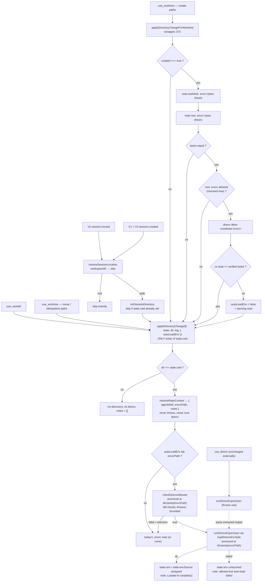

## Context

See `proposal.md` — Why. This section records only the constraints of the
existing code that shape the approach. The scope decisions in the proposal
(feature (d) dropped, (c) narrowed to skip env auto-load at session start,
(e) narrowed to the create path) are **given** and are not revisited here.

Load-bearing facts about the current code:

- **`applyDirectoryChange($, state, resolvedDir, log)` (`src/lib.js`) is the
  sole choke point for `state.cwd`.** The archived `auto-load-repo-context`
  design records this as invariant D1; `use_clear` is the only exception and
  only ever nulls. Six call sites route through it today (`executeUseWorkdir`
  ×1, `executeUseWorktree` ×4). Every new directory-changing entry point in
  this change must route through it too — never assign `state.cwd` directly.
- **`resolveRepoContext($, dir, log)` never throws** (archived D8). It already
  computes `envrcPath` internally but discards it, emitting only a note. It
  currently returns `{ agentsMd, notes }`.
- **`resolveRepoContext` currently never invokes a `direnv` subprocess** — a
  spec requirement with a dedicated test (`test/context-autoload.test.js`,
  "detection never invokes a direnv subprocess").
- **`executeUseDirenv` (`src/core.js`) owns the only `direnv` invocation
  today**: `$\`direnv export json\`` plus a three-branch stderr translation
  (blocked → STOP-and-ask, `ENOENT` → not installed, else → raw passthrough),
  then trim → `JSON.parse` → null-filter → `String(v)`.
- **`plugin.v1.js` has no `event` hook at all.** The proposal's Impact line
  ("new `session.created` branch in the existing `event` hook") does not match
  the code — the hook must be **added**. `plugin.v2.js` does have an existing
  `ctx.event.subscribe` loop (`session.deleted` + `mcp.tools.changed`) that
  gains two branches.
- **`resolveEnvSessionForShell` (V2, D6) is fail-closed**: when more than one
  tracked session holds a non-empty `state.env` and `cwd` cannot disambiguate,
  it injects nothing. Anything that increases the number of env-bearing
  sessions increases how often that happens.
- Tests are `node:test` against real temp git repos (`test/helpers.js`), with
  `$` injected per call — there is no global shell to intercept.

## Goals / Non-Goals

**Goals**

- One pipeline owns "the session's active directory changed, and possibly its
  environment with it", so every entry point — tools, session start, V2
  session move — behaves identically and cannot silently diverge.
- `direnv` subprocess work is **bounded in time** and **fail-closed**: a slow,
  missing, or unparseable `direnv` degrades to exactly today's note-only
  behaviour, never to a blocked or failed tool call, and never to "assume
  allowed".
- `executeUseDirenv`'s externally-observable behaviour — return strings, error
  texts, state effects — is **bit-for-bit unchanged** after the refactor.
- Auto-trust is scoped so narrowly that the set of files it can ever bless is
  "the `.envrc` git just checked out into a worktree this call created, whose
  bytes equal an already-allowed root `.envrc` read at trust time".

**Non-Goals**

- No plugin-owned file watcher, no `filesystem.changed` use (feature (d) is
  out of scope entirely).
- No env auto-load at session start on either host.
- No auto-trust on any `use_worktree` reuse path, and no `direnv allow`
  anywhere else in the plugin.
- No change to workdir injection, worktree ownership persistence, or the
  AGENTS.md discovery/size/fence rules.
- No new dependencies; no change to any tool's input schema.

## Decisions

### D1 — `resolveRepoContext` surfaces `envrcPath`; the `.envrc` note moves out of it

`resolveRepoContext` gains one field and **loses the `.envrc` note**:

```js
// Never throws. Failure path resolves to { agentsMd: null, envrcPath: null, notes: [] }.
export async function resolveRepoContext($, dir, log)
  // → { agentsMd: {…}|null, envrcPath: string|null, notes: string[] }
```

`notes` now carries only the AGENTS.md status note. The single `.envrc` note is
emitted one layer up, by `applyDirectoryChange`, which is the only layer that
knows whether auto-load was requested and how it went.

Two options were weighed:

| Option | Trade-off |
| --- | --- |
| **(chosen)** Move note emission to `applyDirectoryChange`; `resolveRepoContext` returns `envrcPath` only | One note-selection table in one place; no string surgery; **`resolveRepoContext` keeps its "never invokes a `direnv` subprocess" property intact**, so that existing test and its spec scenario survive verbatim at the discovery layer. Cost: `resolveRepoContext`'s `notes` shape changes, so two existing assertions in `test/context-autoload.test.js` move up a layer. |
| Keep the note in `resolveRepoContext`; have `applyDirectoryChange` replace or drop the last note when it auto-loads | No test churn at the discovery layer, but the caller must identify "the `.envrc` note" positionally or by substring match to replace it — fragile, and it puts two functions in charge of one string. |

The never-throws contract is preserved by construction: `envrcPath` is already
computed inside the existing `try`, and the single `catch` gains
`envrcPath: null`. No new I/O and no new failure mode is introduced in this
function — `resolveRepoContext` still does filesystem existence checks only,
still never reads or executes `.envrc`.

### D2 — `checkDirenvAllowed`: never throws, fail-closed, timeout-bounded

```js
// Never throws. Returns false for every uncertainty.
export async function checkDirenvAllowed($, { anchorDir, envrcPath }, log)
  // → Promise<boolean>

// Pure, exported for fixture-driven unit tests.
export function isDirenvStatusAllowed(status, envrcPath) // → boolean
```

`checkDirenvAllowed` runs `direnv status --json` with `.cwd(anchorDir)` under
`DIRENV_TIMEOUT_MS`, `JSON.parse`s stdout, and delegates the verdict to the
pure predicate. It returns `false` — meaning "treat as not allowed, keep
today's note-only behaviour" — on **every** one of: non-zero exit, `ENOENT`
(`direnv` absent), timeout, empty stdout, malformed JSON, or a status object
whose shape the predicate does not recognise. Each returns-false-because is
logged via the existing `log` helper.

Two properties are deliberate:

- **Fail-closed is the safe direction here.** The failure mode of a false
  negative is "the agent gets today's `use_direnv` suggestion"; the failure
  mode of a false positive is "the plugin executes an `.envrc` the user never
  trusted". The asymmetry decides the default with no further argument.
- **The shape knowledge lives in one pure function.** `isDirenvStatusAllowed`
  takes the already-parsed object plus the `envrcPath` discovery found, and
  answers "does this status report *that specific file* as allowed?". Matching
  on the path matters: `direnv status` reports on whatever RC it itself found,
  and direnv's own upward search is **not** bounded by the git root while
  discovery's is (D3). A status hit for a different file must not be read as a
  hit for ours. Isolating this in a pure function means the predicate is
  testable from pinned JSON fixtures with no subprocess, and a future direnv
  output change touches exactly one function.

> **Verified** (direnv 2.37.1, captured directly against a real temp repo,
> `/tmp/opencode/direnv-test2`, during implementation planning):
>
> ```jsonc
> // allowed
> { "state": { "foundRC": { "allowed": 0, "path": "<dir>/.envrc" }, "loadedRC": null } }
> // not yet allowed (never approved)
> { "state": { "foundRC": { "allowed": 1, "path": "<dir>/.envrc" }, "loadedRC": null } }
> // explicitly denied (`direnv deny`)
> { "state": { "foundRC": { "allowed": 2, "path": "<dir>/.envrc" }, "loadedRC": null } }
> // no .envrc anywhere in direnv's own (unbounded) upward search
> { "state": { "foundRC": null, "loadedRC": null } }
> ```
>
> `isDirenvStatusAllowed` returns `true` only for `foundRC.allowed === 0 &&
> foundRC.path === envrcPath` (exact match — D3's path-matching argument holds:
> a hit for a different, e.g. ancestor, path must not read as a hit for the
> file discovery reported). `allowed: 1` and `allowed: 2` are both "not
> allowed" for this predicate's purposes — the distinction between
> never-approved and explicitly-denied does not change this change's
> behaviour (both keep today's note-only fallback), but pin both values as
> separate fixtures so a future change that wants to distinguish them has the
> data. Pin all four fixtures verbatim in `test/direnv-status.test.js`,
> annotated with the direnv version above.

### D3 — All direnv work is anchored at `dirname(envrcPath)`, never at the resolved leaf

Every `direnv` invocation in the auto-load path runs with
`.cwd(dirname(envrcPath))`, where `envrcPath` is the file **discovery actually
found** (D1), not the resolved leaf directory.

This is not cosmetic. Discovery walks upward bounded by the git root; direnv's
own upward search is unbounded. Running `direnv export json` at the leaf could
therefore load an `.envrc` above the git root that discovery never saw and
never reported — the note would name one file and the environment would come
from another. Anchoring makes the loaded environment provably the one reported,
and makes `state.envSource` (`direnv:<dirname(envrcPath)>`) name a directory
that an agent can pass straight back to `use_direnv` to reproduce the load.

### D4 — `runDirenvExportJson` throws raw; `executeUseDirenv` keeps its own translation

```js
// Throws. Propagates the raw $ rejection (preserving .stderr / .code) and any
// JSON.parse error, unwrapped.
export async function runDirenvExportJson($, dir)
  // → Promise<Record<string,string>>   (null-filtered, String()-coerced delta)
```

This extracts exactly today's raw sequence — run → `.text()` → trim →
`JSON.parse` (empty stdout → `{}`) → drop `null` values → `String(v)` — and
nothing else. It is the **throwing** boundary; the two callers sit on either
side of it:

| Caller | Wrapping |
| --- | --- |
| `executeUseDirenv` | Keeps its existing `try`/`catch` **verbatim** around the call: the blocked-`.envrc` STOP message, the `ENOENT` "not installed" message, and the `direnv export json failed in <dir>: …` fallback all stay in `core.js`, unchanged, and still inspect `err.stderr` / `err.code`. A `JSON.parse` failure still escapes to the outer `catch` and rethrows, exactly as today. |
| Auto-load path (`lib.js`) | Wrapped by a private, never-throwing `loadDirenvEnvSafe($, dir, log)` that applies `DIRENV_TIMEOUT_MS` and returns `Record<string,string>` on success or `null` on any failure, logging the reason. It needs **none** of the rich translation: the allowed-check already passed, and its remedy for every failure is identical (fall back to the note). |

Because `runDirenvExportJson` throws the raw error rather than a normalised
one, `executeUseDirenv` requires **no** change to its error texts — which is
what makes "external behaviour unchanged" a checkable property rather than a
hope. A normalised error type was considered and rejected: it would force
`executeUseDirenv` to re-derive `blocked`/`ENOENT` from a new discriminator,
which is a rewrite of the exact code the refactor is supposed to leave alone.

`executeUseDirenv` keeps ownership of its own state writes (`state.env`,
`state.envSource`) and its own return-string construction; only the raw
export/parse moves.

### D5 — `applyDirectoryChange` gains an explicit, default-`false` options argument

```js
export async function applyDirectoryChange($, state, resolvedDir, log, options = {})
  // options: { autoLoadEnv?: boolean }   — default false
  // → { changed: boolean, notes: string[] }
```

Stage order (the `changed` gate and the `state.cwd` assignment are untouched):

1. `changed = state.cwd !== resolvedDir`; assign `state.cwd = resolvedDir`.
2. `if (!changed) return { changed: false, notes: [] }` — **no direnv work on a
   no-op call**, preserving the existing Directory-Change Detection Gate and
   keeping idempotent calls free of subprocesses.
3. `resolveRepoContext` → `{ agentsMd, envrcPath, notes }`; assign
   `state.agentsMd = agentsMd`.
4. If `!options.autoLoadEnv || !envrcPath` → append the note from the table
   below and return.
5. `checkDirenvAllowed` at `dirname(envrcPath)` (D2, D3). Not allowed → append
   today's note unchanged and return.
6. `loadDirenvEnvSafe` at `dirname(envrcPath)` (D4). On success assign
   `state.env` and `state.envSource`; append the matching note. On failure
   leave `state.env`/`state.envSource` **untouched** and append the retry note.

Note table (deterministic order: AGENTS.md note first, then exactly one of
these):

| Condition | Note |
| --- | --- |
| `.envrc` found, `autoLoadEnv` false | *(today's text, unchanged)* `Found .envrc at <path> — call use_direnv('<dir>') to load it (not loaded automatically).` |
| found, auto-load requested, not allowed | *(today's text, unchanged)* |
| found, allowed, loaded N ≥ 1 vars | `Loaded N variable(s) from .envrc at <path> (already allowed by direnv).` |
| found, allowed, loaded 0 vars | `.envrc at <path> is allowed by direnv and was loaded — no environment changes exported.` |
| found, allowed, load failed | `Found .envrc at <path> — it is allowed by direnv but automatic loading failed; call use_direnv('<dir>') to retry.` |

**Why the default is `false`, given that six of seven call sites want `true`.**

| Option | Trade-off |
| --- | --- |
| **(chosen)** Default `false`; every call site passes the option explicitly; a source-guard test enforces explicitness | A call site added later that forgets the argument gets today's behaviour — a missing convenience. Cost: six explicit arguments, one cheap guard test. |
| Default `true`; session-start init opts out | One argument instead of six. A call site added later that forgets the argument silently **executes an `.envrc` subprocess** it was never meant to. |

The failure modes are not comparable: one is a lost convenience, the other is
an unintended `.envrc` execution on a path nobody reviewed for it. The repo
already has precedent for a source-text invariant guard (the archived D1 guard
on `state.cwd =`), so enforcement is a known, cheap pattern here.

Note that `state.env` is **never cleared** by a directory change — moving to a
directory with no `.envrc`, or an untrusted one, leaves the previous
environment in place. This matches `use_direnv`'s existing precedent (it
overwrites, never clears) and keeps `use_clear(['env'])` the single explicit
way to drop an environment.

### D6 — Session start and V2 session move: one location helper, one init function, both through the choke point

Two new exports in `core.js`, both host-agnostic:

```js
// Pure. V2 location shape; V1 passes { directory } so both hosts share it.
export function resolveSessionLocation(location) // → string | null

// Never throws. Validates, then routes through applyDirectoryChange.
export async function initSessionDirectory(state, resolvedDir, deps, { autoLoadEnv, requireUnsetCwd = true })
  // → Promise<void>
```

`requireUnsetCwd` (default `true`) governs whether the race guard described
below applies. Session-start init needs it — an in-flight first `use_workdir`
must win. Session-move does not: the `context-autoload` spec's "Session move
to a directory with an already-allowed .envrc auto-loads its environment"
scenario requires `session.moved` to update an already-set `state.cwd` (the
normal case for an existing session), which the shared guard would otherwise
block. The V2 `session.moved` call site passes `requireUnsetCwd: false`
(alongside `autoLoadEnv: true`) for exactly this reason — see the host wiring
table below.

`resolveSessionLocation` returns `null` when `location?.workspaceID` is present
(the directory is then not a local filesystem path and must not be `stat`ed or
`cd`ed into) or when `directory` is falsy; otherwise it returns
`join(location.directory, location.subpath ?? '')`. One helper, both hosts,
one place where the `workspaceID` skip rule lives.

`initSessionDirectory` `stat`s the path (skipping silently if it is missing or
not a directory), then calls `applyDirectoryChange($, state, resolvedDir, log,
{ autoLoadEnv })` — **never assigning `state.cwd` itself**. There is no tool
return value to attach notes to, so it logs the returned notes and swallows
everything. It is `try`/`catch`-wrapped end to end: a plugin event handler that
rejects is a defect on both hosts.

Host wiring:

| Host | Event | Location source | `autoLoadEnv` | `requireUnsetCwd` |
| --- | --- | --- | --- | --- |
| V1 | `session.created`, via a **newly added** `event` hook | `event.properties.info.directory` (passed as `{ directory }`) | `false` | `true` (default) |
| V2 | `session.created`, new branch in the existing `ctx.event.subscribe` loop | `event.data.location` → `resolveSessionLocation` | `false` | `true` (default) |
| V2 | `session.moved`, new branch in the same loop | `event.data.location` → `resolveSessionLocation` | **`true`** — a move is treated exactly as a `use_workdir` call | **`false`** — a move must update `state.cwd` even when already set |

Session-start init applies to **every** session including subagents; `parentID`
is not consulted and must not be special-cased (confirmed user decision).

**Race guard.** Init is asynchronous relative to the first turn, so a
`use_workdir` call can land while init is in flight. `initSessionDirectory`
therefore re-checks `state.cwd` immediately before calling the choke point and
**returns without acting if `state.cwd` is already set** — an explicit agent
action always outranks the host's starting location. This guard applies only
when `requireUnsetCwd` is `true` (the default, used by both `session.created`
call sites); `session.moved` passes `requireUnsetCwd: false` and always
proceeds, since a move is a new, authoritative directory for an existing
session, not a race with an in-flight first `use_workdir`. A full per-session FIFO
serialisation chain (the `createWorktreePersistence.enqueue` pattern) was
considered and rejected as disproportionate: the residual interleaving window
is an `await` inside a best-effort initialiser whose worst outcome is a stale
advisory block that the next directory change repairs.

> **Verified** against the installed `@opencode-ai/sdk` types (V1) and the
> current `@opencode/schema` source at the pinned commit matching published
> `2.0.16` (V2):
>
> - **V1** `session.created`: `EventSessionCreated = { type: "session.created",
>   properties: { info: Session } }`, where `Session = { id: string, directory:
>   string, parentID?: string, ... }`. Path: `event.properties.info.directory`;
>   session id: `event.properties.info.id`. Matches the table above exactly —
>   no change needed.
> - **V2** `session.created` / `session.moved`: both are durable events whose
>   envelope is `{ id, type, created, data, location?, metadata?, durable }` —
>   the payload fields live under **`data`**, never at the top level and never
>   under a top-level `location` (that field is a separate, optional envelope
>   field unrelated to the session's own location). So: `event.data.sessionID`
>   (not `event.sessionID`, not `event.data.id`), `event.data.location` (→
>   `resolveSessionLocation`), `event.data.subpath` (optional, `created` only
>   carries it too), `event.data.projectID`. `session.moved`'s `data` is
>   `{ sessionID, location, projectID, subpath? }` exactly (`SessionInbox.
>   MovePayload.fields` spread alongside `sessionID`) — no `delivery` field on
>   the emitted event itself (that lives only on the inbox item wrapper, not
>   the event). Both adapter branches must read from `event.data`, not
>   `event`.

### D7 — `applyDirectoryChangeForWorktree` wraps the choke point; auto-trust is create-only and TOCTOU-safe

```js
export async function applyDirectoryChangeForWorktree(
  $, state, resolvedDir, log, { repoRoot, created }
) // → { changed: boolean, notes: string[] }
```

It **wraps, never replaces** `applyDirectoryChange` — the invariant that
`state.cwd` is assigned in exactly one function is untouched. Sequence:

1. `created !== true` → delegate directly to
   `applyDirectoryChange(…, { autoLoadEnv: true })` and return. No trust step
   on any reuse path, owned or unowned.
2. `created === true` → run `maybeAutoTrustWorktreeEnvrc` first, so that if it
   blesses the file, the very same pass auto-loads it.
3. `applyDirectoryChange(…, { autoLoadEnv })`, where `autoLoadEnv` is `false`
   only in the post-allow-mismatch case below, `true` otherwise.
4. Return `{ changed, notes: [...trustNotes, ...changeNotes] }` — trust note
   first, matching causal order.

`executeUseWorktree` hooks it into **only** the two create-path success
returns: the primary bottom-of-function return, and the "existing branch
checked out" recovery return (both currently set `owned: true` after a
successful `git worktree add`). The two "already exists — reusing it" returns
and the idempotent same-path early return keep calling `applyDirectoryChange`
directly with `{ autoLoadEnv: true }`. `repoRoot` is the `root` already
resolved by `resolveGitRoot` earlier in the function.

```js
// Never throws. Returns { notes, contentVerified } — contentVerified false
// means the caller must skip auto-load for this pass.
async function maybeAutoTrustWorktreeEnvrc($, { repoRoot, worktreePath }, log)
```

**TOCTOU-safe ordering.** Nothing is reused from `resolveRepoContext`'s earlier
`stat` — not the existence result, not a path, not a size. Each step reads
fresh at the moment of decision:

1. `readFile(join(worktreePath, '.envrc'))` → `wtBytes`. Any error (including
   `ENOENT`) → no-op, no note, no `direnv` call.
2. `readFile(join(repoRoot, '.envrc'))` → `rootBytes`. Any error → no-op.
3. `rootBytes.equals(wtBytes)` must hold → otherwise no-op plus a short note
   stating the worktree `.envrc` differs from the root's and was not trusted.
4. `checkDirenvAllowed($, { anchorDir: repoRoot, envrcPath: join(repoRoot,
   '.envrc') })` must return `true` → otherwise no-op plus a note that the
   root's `.envrc` is itself not allowed.
5. `$\`direnv allow <worktree/.envrc>\`` under `DIRENV_TIMEOUT_MS`. Failure →
   log plus a note; no throw.
6. **Post-allow verification:** re-read the worktree `.envrc` and compare to
   `wtBytes`. Equal → success note. Different → return
   `contentVerified: false` plus a loud warning note naming the file and
   telling the user to inspect it and re-allow manually; the caller then skips
   auto-load for this pass.

Both paths are **fixed at the directory level — no upward search**. Only the
repo root's own `.envrc` is ever compared, and only the new worktree's own
`.envrc` is ever allowed. An inherited ancestor `.envrc` is never auto-trusted:
the byte-identity argument is only defensible for the root↔worktree pair, since
a worktree is a checkout of the same tracked tree.

Step 6 exists because `direnv allow` hashes the file **as it is on disk when
`allow` runs**, not the bytes we compared in step 1. Without step 6 the plugin
could bless content it never verified. Step 6 does not eliminate the window —
it detects it after the fact — but it converts a silent unverified trust into a
visible warning plus a skipped auto-load, using only commands the plugin
already invokes (no `direnv deny`, whose exact behaviour is not verified here).
Remediating by running `direnv deny` was considered and deferred: it adds an
unverified command and a new failure path for a case this change already makes
loud and non-loading.

### D8 — No session-store changes

`SessionState` is unchanged: `{ cwd, env, envSource, worktree, agentsMd }`.
Auto-load writes `env` and `envSource` with exactly the semantics
`executeUseDirenv` already gives them (`envSource` is
`direnv:<dirname(envrcPath)>`), so `buildActiveSessionContextBlock`,
`resolveEnvSessionForShell`, `filterInjectableEnv`, `executeUseClear`, and the
session-state literal inside `createWorktreePersistence.validateRepoGroup` all
keep working with no edit.

A `lastAutoLoadedEnvrc` field (to avoid redundant re-loads) was considered and
rejected as YAGNI: the existing `changed` gate already prevents any repeat
within one directory, and adding a field would force a matching change to the
persistence hydration literal for no present benefit.

`DIRENV_TIMEOUT_MS` is a single exported constant in `lib.js`, applied
independently to each of the three `direnv` invocations (`status`, `export`,
`allow`), mirroring the existing `HYDRATION_TIMEOUT_MS` convention. A
timed-out promise is abandoned with a `.catch(() => {})` (there is no way to
abort a running Bun `$` subprocess) and treated as failure.

### Pipeline



## Risks / Trade-offs

- **Byte-identical `.envrc` can still behave differently in the new worktree
  (feature (e), accepted residual risk).** Auto-trust proves only content
  equality. An `.envrc` containing `source_up`, `dotenv .env`, `PATH_add
  ./bin`, or any other relative directive resolves those against the **new**
  worktree's surroundings, which may contain different — and untracked, hence
  never reviewed by git — files. The blessed file is therefore identical while
  the environment it produces may not be. → **Accepted and documented**, in
  this section and in the `worktree-envrc-trust` delta spec. Bounding factors
  recorded rather than mitigated: trust fires only when *this call* just
  created the worktree; the root `.envrc` it is compared against must itself be
  allowed at that same moment; the comparison is root-directory-to-worktree-
  directory only, never an inherited ancestor; and the plugin runs `direnv
  allow` in no other circumstance anywhere. A content-inspection gate (refusing
  to auto-trust an `.envrc` containing relative-resolution directives) was
  considered and rejected for this change: it is a parser for a shell dialect,
  it is trivially evaded, and a false sense of coverage is worse than a clearly
  documented boundary.
- **Post-`allow` modification window (D7 step 6).** `direnv allow` hashes the
  file at allow time, not at compare time. → Detected after the fact by the
  re-read, which downgrades to "warned, not loaded". Not eliminated.
- **V1/V2 asymmetry.** Feature (b) — the session-move listener — is **V2-only**;
  V1 has no `session.moved` equivalent. Feature (d) was dropped entirely, so it
  contributes no asymmetry. Features (a), (c) and (e) are identical on both
  hosts. → Accepted; the delta spec must state the V2-only scope of the move
  listener explicitly rather than leaving it implicit, and the V1 adapter test
  suite must not assert a move branch exists.
- **More sessions become env-bearing than before — a consequence of (a) that
  descoping (c) does not remove.** Today a session holds an environment only
  after a deliberate `use_direnv`. After this change, any `use_workdir` into an
  already-allowed `.envrc` directory makes the session env-bearing. On V2 that
  raises how often `resolveEnvSessionForShell` hits its ambiguous branch and
  suppresses injection. → Accepted, with two bounding facts: auto-loaded
  sessions have, by construction, a `state.cwd` at or under the `.envrc`'s
  directory, so the ladder's `cwd` disambiguation usually resolves them; and
  the existing `V2_ENV_INJECTION_CAVEAT` already surfaces the suppression
  in-band when it can occur. Worth re-measuring after rollout.
  This is a known, currently-open upstream gap, not something specific to
  this plugin's design: [anomalyco/opencode#41117](https://github.com/anomalyco/opencode/issues/41117)
  ("V2 Bash tool does not apply plugin `shell.env` hooks") proposes fixing
  the root cause by adding `sessionID`/`callID` to the hook payload — exactly
  what `resolveEnvSessionForShell`'s ladder is a workaround for — and
  [#40657](https://github.com/anomalyco/opencode/issues/40657) is a second,
  related open request for an optional `sessionID` on `Shell.create`'s input.
  Both are open and unfixed as of this change; if either ships, the ladder in
  `resolveEnvSessionForShell` becomes an unnecessary fallback rather than the
  only option, and could be simplified in a future change — no action needed
  now.
- **Two extra subprocesses on the `use_workdir` hot path.** A `direnv status`
  and possibly a `direnv export` now run on every genuine directory change into
  an `.envrc` directory. → Bounded by `DIRENV_TIMEOUT_MS` per invocation, gated
  on `changed` (no-op calls stay free), and short-circuited entirely when no
  `.envrc` was discovered. A slow direnv delays, but cannot fail, the
  directory change.
- **`direnv status --json` output shape is unverified in this design (D2).** →
  Confined to one pure predicate driven by pinned fixtures; every unrecognised
  shape resolves to `false`, so a shape change degrades to today's behaviour
  rather than to a wrong trust decision.
- **`executeUseDirenv` regression during extraction.** → Mitigated by keeping
  the raw error unwrapped (D4) and by asserting its three existing error texts
  and both return strings as-is in the existing tests, which must pass
  unmodified.
- **A future directory-changing call site bypasses the pipeline.** → The D1/D5
  invariant plus the source-guard test below.

## Migration Plan

Additive, with three behavioural changes that are not pure additions:

1. **`resolveRepoContext`'s `notes` no longer contains the `.envrc` note** (D1).
   Internal function, no external contract — but two assertions in
   `test/context-autoload.test.js` move up to the `applyDirectoryChange` layer.
   The "never invokes a `direnv` subprocess" test stays where it is and keeps
   its meaning.
2. **`applyDirectoryChange` gains a fifth parameter** with a safe default, so
   an un-updated call site keeps today's behaviour.
3. **`use_workdir`/`use_worktree` may now execute an `.envrc`** where they
   previously only reported one. This is the point of the change; it must be
   reflected in the `use_workdir` and `use_worktree` tool descriptions, the
   `context-autoload` delta spec, and the README line currently describing
   `.envrc` handling as detect-never-execute.

Revert is a clean removal: nothing is persisted outside the in-process session
map, except one side effect that does **not** revert — an `.envrc` auto-trusted
under D7 stays allowed in the user's direnv state after the plugin is rolled
back. Record this in the change notes; the remedy is a manual `direnv deny`.

## Component Breakdown

| Component | Work kind | Done when |
| --- | --- | --- |
| `resolveRepoContext` `envrcPath` (D1) | Application code (`src/lib.js`) | Returns `{ agentsMd, envrcPath, notes }`; `notes` carries no `.envrc` entry; the `catch` returns `envrcPath: null`; still performs existence checks only and still invokes no `direnv` subprocess. |
| `isDirenvStatusAllowed` (D2) | Application code, exported, pure | Returns `true` only for a status object that reports the given `envrcPath` as allowed; `false` for not-allowed, denied, a different RC path, and any unrecognised shape. Driven by pinned fixtures captured from the installed direnv, with the direnv version recorded. |
| `checkDirenvAllowed` (D2) | Application code, exported | Runs `direnv status --json` at `anchorDir` under `DIRENV_TIMEOUT_MS`; **never throws**; returns `false` on non-zero exit, `ENOENT`, timeout, empty stdout, parse failure, or predicate rejection; logs every false-because reason. |
| `runDirenvExportJson` (D4) | Application code, exported | Performs exactly today's run/trim/parse/null-filter/`String()` sequence; **throws the raw `$` rejection unwrapped**, preserving `.stderr` and `.code`; lets a `JSON.parse` error propagate. |
| `executeUseDirenv` refactor (D4) | Application code (`src/core.js`) | Calls `runDirenvExportJson`; retains its blocked / `ENOENT` / fallback translation, its state writes, and both return strings **verbatim**; every existing `use_direnv` assertion passes unmodified. |
| `loadDirenvEnvSafe` + `DIRENV_TIMEOUT_MS` (D4, D8) | Application code (`src/lib.js`) | Never-throwing, timeout-bounded wrapper returning the env delta or `null`; timed-out promise is abandoned with an attached no-op `catch`. |
| `applyDirectoryChange` auto-load stage (D3, D5) | Application code (`src/lib.js`) | Fifth `options` parameter defaulting to `{ autoLoadEnv: false }`; no direnv work on a no-op call; all direnv work anchored at `dirname(envrcPath)`; emits exactly one note from D5's table; on load failure leaves `state.env`/`state.envSource` untouched; still the only writer of `state.cwd`. |
| `resolveSessionLocation` (D6) | Application code (`src/core.js`), pure | Returns `null` when `workspaceID` is present or `directory` is falsy; otherwise `join(directory, subpath ?? '')`. |
| `initSessionDirectory` (D6) | Application code (`src/core.js`) | Never throws; skips a missing/non-directory path; skips when `state.cwd` is already set; routes through `applyDirectoryChange` with the caller's `autoLoadEnv`; logs notes; assigns `state.cwd` nowhere itself. |
| V1 `event` hook (D6) | Application code (`src/plugin.v1.js`) | A **new** `event` hook (none exists today) with a `session.created` branch reading `properties.info.directory`, calling `initSessionDirectory` with `autoLoadEnv: false`; wrapped so it can never reject. |
| V2 event branches (D6) | Application code (`src/plugin.v2.js`) | `session.created` (`autoLoadEnv: false`) and `session.moved` (`autoLoadEnv: true`) branches added to the existing `ctx.event.subscribe` loop, ahead of the `mcp.tools.changed` check, each computing its path via `resolveSessionLocation` and skipping on `null`; existing `session.deleted` and reload branches unaffected. |
| `maybeAutoTrustWorktreeEnvrc` (D7) | Application code (`src/lib.js`) | Fresh reads at every decision point with nothing cached from discovery; directory-level paths only, no upward search; ordered bytes-compare → root-allowed-check → `direnv allow` → post-allow re-read; never throws; returns notes plus `contentVerified`. |
| `applyDirectoryChangeForWorktree` (D7) | Application code (`src/lib.js`), exported | Delegates to `applyDirectoryChange` on every non-create path; on the create path runs trust first, then the choke point, never bypassing it; sets `autoLoadEnv: false` only on post-allow mismatch; returns trust notes ahead of change notes. |
| `executeUseWorktree` rewiring (D7) | Application code (`src/core.js`) | Only the two create-path success returns use the wrapper with `created: true` and the already-resolved `repoRoot`; the reuse and idempotent returns call `applyDirectoryChange` with an explicit `{ autoLoadEnv: true }`; no return string changes beyond appended notes. |
| Delta specs | Docs (`openspec/specs/`) | `context-autoload`'s `.envrc Detection Reminder` re-scoped: discovery still never runs `direnv`, with conditional auto-load added as its own requirement; session-start auto-init (env excluded, subagents included) and the **V2-only** move listener added. New `worktree-envrc-trust` spec with the create-only positive requirement and the explicit negative requirement that the plugin runs `direnv allow` nowhere else. |
| Documentation | Docs (`README.md`, tool descriptions) | `use_workdir`/`use_worktree` descriptions and the README describe conditional auto-load (allowed → loaded; not allowed → suggestion only), session-start init without env, the V2-only move listener, and the create-only auto-trust with its residual-risk caveat; the detect-never-execute line is corrected. |
| Test coverage | Test code (`test/`) | Per the strategy below. |

### Test strategy pointers

Enough to derive `tasks.md`; not test code.

- **`test/helpers.js`** — add `makeFakeDirenvShell({ status, exportJson, allow,
  hang })`: routes `direnv status`, `direnv export`, and `direnv allow` to
  canned outcomes (success / non-zero with `.stderr` / `ENOENT` / never
  resolving) and delegates everything else to the existing `nodeShellShim`, so
  git stays real. Every direnv test injects this; no test may require direnv on
  the host.
- **`test/direnv-status.test.js` (new)** — fixture-driven
  `isDirenvStatusAllowed` cases (allowed, not-allowed, denied, no RC, different
  RC path, unrecognised shape) plus `checkDirenvAllowed`'s fail-closed matrix
  (non-zero, `ENOENT`, timeout via the hanging shell, empty stdout, malformed
  JSON) asserting `false` and no throw in every case.
- **`test/direnv-autoload.test.js` (new)** — `applyDirectoryChange` with
  `autoLoadEnv` true/false × `.envrc` present/absent × allowed/not-allowed ×
  export ok/failed: assert the note text from D5's table, `state.env` and
  `state.envSource` contents, that a failed load leaves both untouched, that a
  no-op (unchanged directory) call runs **no** direnv subprocess at all, and —
  with the `.envrc` planted at an **ancestor** of the resolved directory — that
  every direnv invocation received `dirname(envrcPath)` as its cwd (D3).
- **`test/worktree-envrc-trust.test.js` (new)** — real temp repo plus real `git
  worktree add`, fake direnv: create path with identical + allowed root
  `.envrc` → `direnv allow` invoked against the worktree file and env
  auto-loaded; differing bytes → no allow; root not allowed → no allow; reuse
  path and idempotent path → no allow; `allow` failing → note, no throw;
  post-allow re-read mismatch → warning note and **no** env load. Assert the
  ordering of reads relative to the allow (the fake shell records a call log)
  to pin the TOCTOU sequence.
- **`test/session-init.test.js` (new)** — `resolveSessionLocation` (plain
  directory, `subpath` joined, `workspaceID` → `null`, missing directory →
  `null`); `initSessionDirectory` skipping a non-existent path, skipping when
  `state.cwd` is already set, never throwing, never auto-loading env when
  `autoLoadEnv` is false, and going through the choke point (assert
  `state.agentsMd` was populated, since only the choke point does that).
- **`test/context-autoload.test.js` (existing)** — move the two `.envrc`-note
  assertions up to `applyDirectoryChange`; **keep** "detection never invokes a
  direnv subprocess" asserted against `resolveRepoContext`; add an
  `envrcPath`-returned assertion.
- **`test/plugin-v2-conformance.test.js` (existing)** — extend the fake `ctx`
  with an `event.subscribe` async iterable emitting `session.created`,
  `session.moved` (both with and without `workspaceID`), and a `session.moved`
  with a `subpath`; assert `state.cwd` is set, that created does **not**
  auto-load env while moved does, that a `workspaceID` payload is skipped
  entirely, and that the existing `session.deleted` / `mcp.tools.changed`
  branches still fire.
- **`test/plugin-v1-events.test.js` (new)** — the newly added V1 `event` hook:
  `session.created` sets `state.cwd` and loads AGENTS.md without env; a
  malformed payload is swallowed; assert **no** `session.moved` branch exists
  (the V1/V2 asymmetry is deliberate).
- **Source-guard test (extend the existing guard file, or `test/invariants.
  test.js`)** — read `src/*.js` and assert (a) no `state.cwd =` assignment
  outside `applyDirectoryChange` and `executeUseClear`, and (b) every
  `applyDirectoryChange(` call in `src/` passes an explicit fifth argument
  (D5). Both must fail with a message naming the offending file and line.

## Open Questions

None remaining. Both verification items originally listed here — the
`direnv status --json` field enumeration (D2) and the `session.created` /
`session.moved` payload field names on each host (D6) — were confirmed
directly (against a real direnv 2.37.1 process, and against the installed
`@opencode-ai/sdk` types plus the current `@opencode/schema` source at
`2.0.16`) and are now recorded inline at D2 and D6 above.
